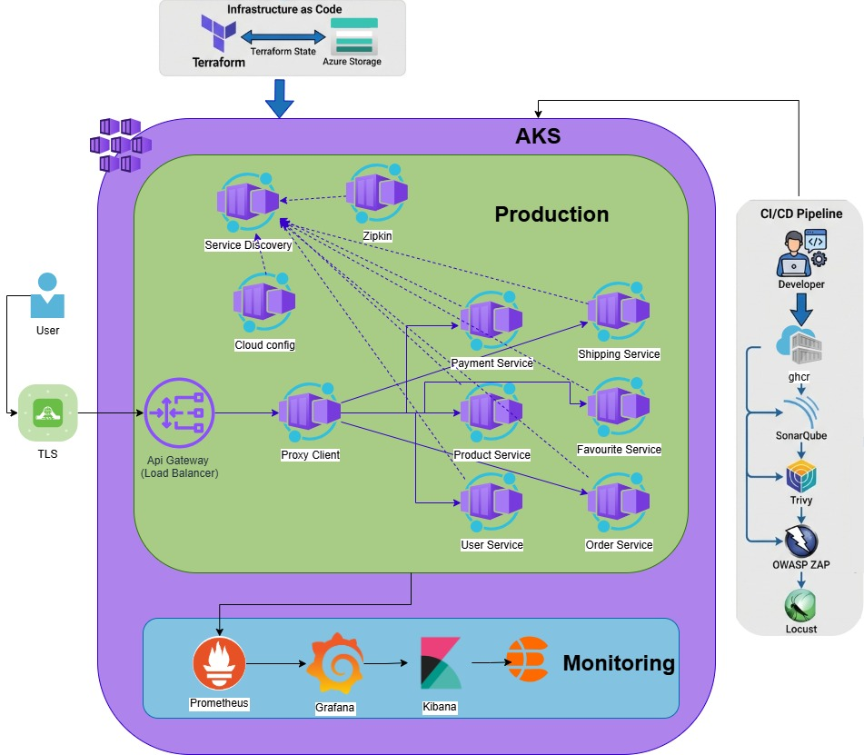
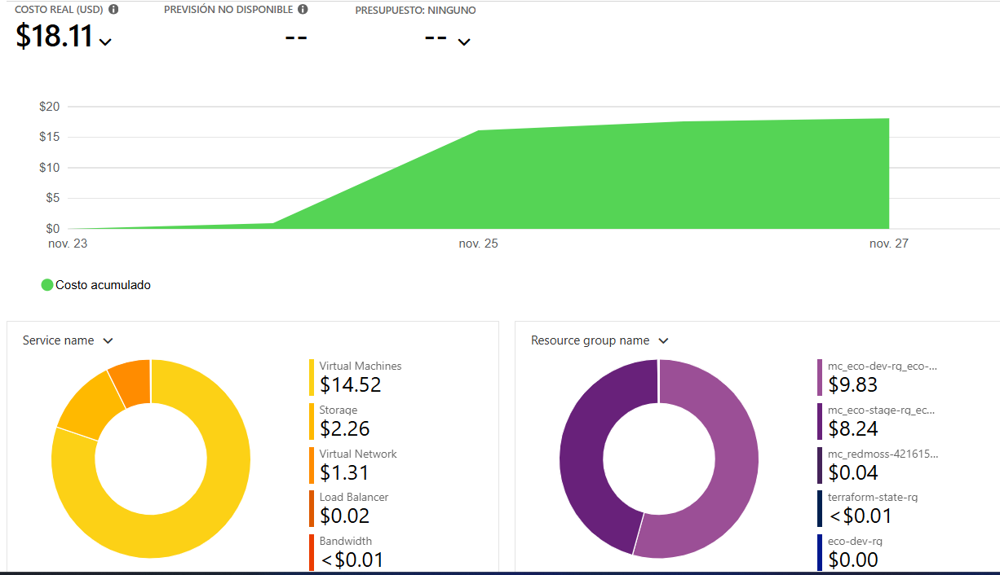
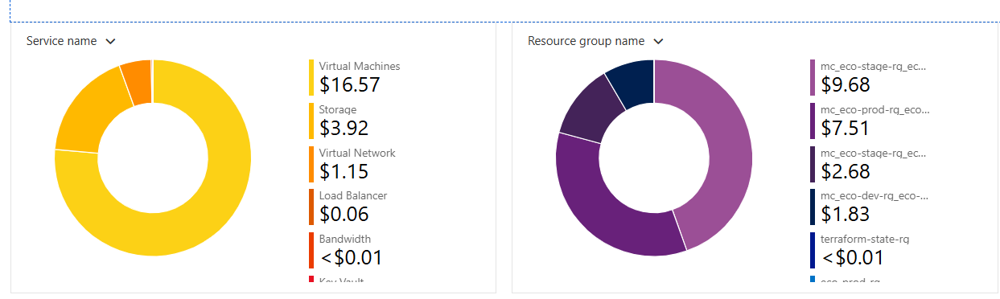
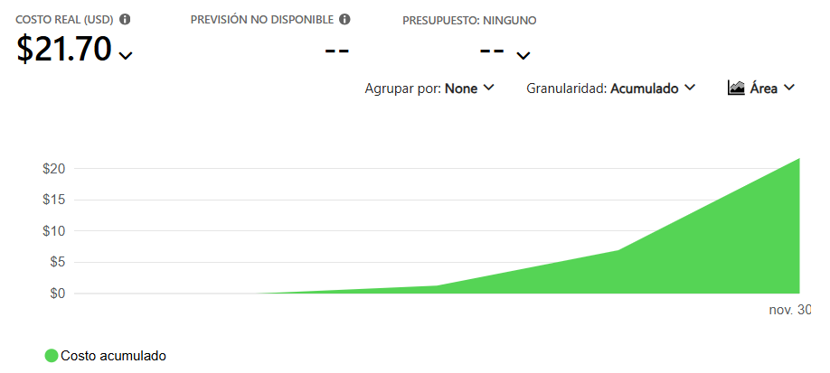

# 🚀 E-Commerce Microservices - Proyecto de Ingeniería de Software V

[](https://kubernetes.io/)
[](https://www.docker.com/)
[](https://azure.microsoft.com/)
[](https://spring.io/projects/spring-boot)
[](https://openjdk.org/)

---

## 📋 Tabla de Contenidos

- [Información del Proyecto](#-información-del-proyecto)
- [Arquitectura del Sistema](#-arquitectura-del-sistema)
- [Análisis de Costos](#-análisis-de-costos-azure)
- [Documentación del Proyecto](#-documentación-del-proyecto)
  - [Gestión de Proyecto](#gestión-de-proyecto)
  - [Arquitectura y Diseño](#arquitectura-y-diseño)
  - [Operaciones y Despliegue](#operaciones-y-despliegue)
  - [Testing y Calidad](#testing-y-calidad)
- [Evolución del Proyecto](#-evolución-del-proyecto)
- [Equipo](#-equipo)

---

## 📋 Información del Proyecto

Este proyecto es un **fork** del repositorio original [ecommerce-microservice-backend-app](https://github.com/SelimHorri/ecommerce-microservice-backend-app) de **Selim Horri**. La documentación completa de la versión base y su arquitectura original se encuentra en [selim-version.md](./docs/initial-part/selim-version.md).

A partir de esta base, se realizaron múltiples mejoras, correcciones arquitectónicas, implementación de pipelines CI/CD, y despliegue en diferentes entornos (Docker Compose, Kubernetes/Minikube y Azure AKS).

### 🎯 Objetivos del Proyecto

1. ✅ **Desplegar** una arquitectura de microservicios completa usando contenedores
2. ✅ **Corregir** problemas arquitectónicos de la versión original
3. ✅ **Implementar** testing completo (unitario, integración, E2E)
4. ✅ **Automatizar** el ciclo de vida con pipelines CI/CD
5. ✅ **Documentar** todo el proceso de despliegue y configuración
6. ✅ **Desplegar en Azure** con infraestructura escalable y segura

---

## 🏗️ Arquitectura del Sistema

### **Arquitectura Mejorada - Azure AKS**



*Arquitectura completa desplegada en Azure Kubernetes Service con componentes de alta disponibilidad*

### **Componentes Principales:**

- **🔍 Service Discovery (Eureka)**: Registro y descubrimiento dinámico de servicios
- **⚙️ Cloud Config**: Configuración centralizada y dinámica
- **🚪 API Gateway**: Punto de entrada único al sistema con routing inteligente
- **🔐 Proxy Client**: Autenticación JWT y autorización
- **📊 Zipkin**: Trazabilidad distribuida de peticiones
- **🗄️ Azure Database for PostgreSQL**: Base de datos gestionada y escalable
- **📦 8 Microservicios de Negocio**:
  - **User Service**: Gestión de usuarios y autenticación
  - **Product Service**: Catálogo de productos
  - **Order Service**: Gestión de órdenes de compra
  - **Payment Service**: Procesamiento de pagos
  - **Shipping Service**: Gestión de envíos
  - **Favourite Service**: Productos favoritos
  - **Cart Service**: Carrito de compras (integrado en Order)
  - **Notification Service**: Notificaciones (futuro)

### **Modelo de Datos - Entity Relationship Diagram**


---

## 💰 Análisis de Costos Azure

El despliegue en Azure AKS ha sido optimizado para balancear rendimiento y costos operativos:

### **Resumen de Costos Mensuales**



*Vista general de costos mensuales del proyecto en Azure*

### **Desglose por Servicios**



*Distribución de costos por servicio de Azure*

### **Proyección y Tendencias**



*Análisis de tendencia y proyección de costos*

**Servicios Principales:**
- Azure Kubernetes Service (AKS)
- Azure Database for PostgreSQL Flexible Server
- Azure Container Registry
- Load Balancer
- Virtual Network
- Storage Accounts

---

## 🎥 Presentación del Proyecto

Presentación ejecutiva del proyecto con arquitectura, implementación, resultados y lecciones aprendidas.

📊 **[Ver Presentación Completa (PDF)](docs/final-part/presentation/Taller%20Final%20Ing%20Soft%20V.pdf)**

---

## 📚 Documentación del Proyecto

### 📋 Gestión de Proyecto

#### **Estándares del Proyecto**
Definición de convenciones, metodologías de trabajo, políticas de branching y estándares de código que guían el desarrollo del proyecto.

📄 **[Ver Estándares del Proyecto](docs/final-part/standars-project.md)**

#### **Historias de Usuario**
Conjunto completo de historias de usuario con criterios de aceptación, priorización y estimación de esfuerzo utilizando metodología ágil.

📖 **[Ver Historias de Usuario](docs/final-part/historias-de-usuario.md)**

#### **Proceso de Gestión de Cambios**
Flujo detallado para la gestión de cambios en el sistema, incluyendo aprobaciones, validaciones y procedimientos de despliegue con matriz RACI.

🔄 **[Ver Proceso de Change Management](docs/final-part/change-management-process.md)**

---

### 🏛️ Arquitectura y Diseño

#### **Patrones de Diseño Implementados**
Análisis completo de patrones arquitectónicos y de diseño aplicados en la solución: Circuit Breaker, API Gateway, Service Discovery, Configuration Server, y más.

🎨 **[Ver Patrones de Diseño](docs/final-part/patrones-de-diseño.md)**

#### **Reporte de Patrones Creados**
Documentación de patrones personalizados desarrollados específicamente para este proyecto, incluyendo implementación de Bulkhead y estrategias de Feature Toggle.

📝 **[Ver Reporte de Patrones Creados](docs/final-part/reporte-patrones-creados.md)**

---

### 🚀 Operaciones y Despliegue

#### **Guía de Despliegue en Azure**
Proceso completo de despliegue en Azure AKS, incluyendo configuración de infraestructura, networking, seguridad y alta disponibilidad.

☁️ **[Ver Guía de Despliegue Azure](docs/final-part/azure-infrastructure-deployment-guide.md)**

#### **Despliegue con Helm en Minikube**
Guía práctica para desplegar el sistema en entorno local usando Helm Charts y Minikube, ideal para desarrollo y testing.

⎈ **[Ver Guía Helm + Minikube](docs/final-part/deployment-helm-minikube.md)**

#### **Manual de Operaciones Básico**
Procedimientos operativos estándar para el día a día: troubleshooting, escalado, monitoreo, respaldos y procedimientos de emergencia.

🔧 **[Ver Manual de Operaciones](docs/final-part/operations-manual.md)**

#### **Plan de Rollback**
Procedimientos detallados para revertir cambios en caso de fallos, incluyendo rollback de servicios, infraestructura y bases de datos con niveles de severidad.

↩️ **[Ver Plan de Rollback](docs/final-part/rollback-plan.md)**

#### **Documentación de Infraestructura como Código**
Documentación completa de la infraestructura: Dockerfiles multi-arquitectura, manifiestos de Kubernetes, Helm Charts, y configuraciones de seguridad.

🏗️ **[Ver Documentación IaC](docs/final-part/infrastructure-documentation.md)**

---

### 🧪 Testing y Calidad

#### **Reporte de Análisis de Testing**
Análisis exhaustivo de la estrategia de testing: 48 tests automatizados (20 unitarios, 7 integración, 21 E2E) con 100% de éxito. Incluye resultados de tests de performance con Locust y security testing.

✅ **[Ver Análisis de Testing Completo](docs/final-part/testing-analysis-report.md)**

#### **Reporte de Tests E2E**
Resultados detallados de los tests End-to-End ejecutados con Newman/Postman, validando flujos completos de usuario a través de todos los microservicios.

🔬 **[Ver Reporte de Tests E2E](docs/final-part/tests-report.md)**

---

### 📖 Documentación Original

#### **Versión Original de Selim Horri**
Documentación completa del proyecto base, incluyendo arquitectura original, decisiones de diseño y configuración inicial antes de las mejoras implementadas.

📜 **[Ver Documentación Original](docs/initial-part/selim-version.md)**

#### **Guía de Despliegue en Minikube (Inicial)**
Proceso de migración de Docker Compose a Kubernetes, correcciones arquitectónicas realizadas y configuración inicial en Minikube.

🔧 **[Ver Despliegue Minikube Inicial](docs/initial-part/deployment-guide-minikube.md)**

---

## 🔄 Evolución del Proyecto

### **Fase 1: Despliegue con Docker Compose** ✅

El primer paso fue desplegar todos los microservicios usando Docker Compose para validar la arquitectura base y comprender las interacciones entre servicios.

**Dashboard de Eureka - Servicios Registrados:**


**Zipkin - Trazabilidad Distribuida:**


**Resultados:**
- ✅ Todos los servicios se comunicaron correctamente
- ✅ Eureka registró todos los microservicios
- ✅ Zipkin capturó las trazas distribuidas
- ⚠️ Se identificaron problemas arquitectónicos con el routing del API Gateway

---

### **Fase 2: Migración a Kubernetes (Minikube)** ✅

Despliegue completo en Kubernetes local usando Minikube, con correcciones arquitectónicas implementadas.

**Minikube Dashboard - Namespace ecommerce:**


**Pods y Services:**


**Arquitectura en Kubernetes:**
- ✅ Namespace dedicado: `ecommerce`
- ✅ ConfigMaps para configuraciones
- ✅ Services ClusterIP para comunicación interna
- ✅ Deployments con réplicas configurables
- ✅ Resources limits y requests

📖 **[Ver Guía Completa de Despliegue Minikube](docs/initial-part/deployment-guide-minikube.md)**

---

### **Fase 3: Despliegue en Azure AKS** ✅

Migración a producción en Azure Kubernetes Service con infraestructura gestionada, alta disponibilidad y seguridad empresarial.

**Características Implementadas:**
- ✅ Azure Kubernetes Service (AKS) multi-nodo
- ✅ Azure Database for PostgreSQL Flexible Server
- ✅ Azure Container Registry (ACR)
- ✅ Load Balancer con IP pública
- ✅ Ingress Controller con TLS/SSL
- ✅ Cert-Manager para certificados Let's Encrypt
- ✅ Network Policies para seguridad
- ✅ Monitoreo con Azure Monitor

☁️ **[Ver Guía de Despliegue Azure Completa](docs/final-part/azure-infrastructure-deployment-guide.md)**

---

### **Fase 4: Automatización CI/CD** ✅

Implementación de pipelines completos para build, testing y deployment automático.

**Pipelines Implementados:**
- ✅ **DEV Pipeline**: Build paralelo + Unit tests
- ✅ **STAGE Pipeline**: Tests completos + Deploy temporal
- ✅ **MASTER Pipeline**: Deploy a producción + Validación E2E

**Resultados:**
- 100% de builds exitosos en todos los ambientes
- Testing automatizado en cada commit
- Deploy automático con validación

---

## 👥 Equipo

**👨‍💻 Autor del Fork:** Nicolás Cuéllar Molina  
**GitHub:** [@Nicolas-CM](https://github.com/Nicolas-CM)

**👨‍💻 Compañero de Trabajo:** Samuel Álvarez Albán  
**GitHub:** [@samuelalvarezalban](https://github.com/samuelalvarezalban)

**🏫 Universidad:** Universidad Icesi  
**📚 Curso:** Ingeniería de Software V  
**📅 Semestre:** 8vo Semestre  
**🗓️ Año:** 2025

**📦 Proyecto Original:** [Selim Horri - ecommerce-microservice-backend-app](https://github.com/SelimHorri/ecommerce-microservice-backend-app)

---

## 📄 Licencia

Este proyecto mantiene la misma licencia del proyecto original.

---

## 📞 Contacto

Para preguntas, sugerencias o reportar problemas:
- **💬 GitHub Issues**: [Crear Issue](https://github.com/Nicolas-CM/ecommerce-microservice-backend-app/issues)
- **📧 Email**: nicolascuellar.molina@gmail.com
- **🌐 Dominio**: [cuellarapp.online](https://cuellarapp.online)

---

## 🚀 Quick Start

```bash
# Clonar el repositorio
git clone https://github.com/Nicolas-CM/ecommerce-microservice-backend-app.git
cd ecommerce-microservice-backend-app

# Opción 1: Docker Compose (Desarrollo local)
docker-compose up -d

# Opción 2: Minikube (Kubernetes local)
minikube start --cpus=4 --memory=8192
kubectl apply -f k8s/base/

# Opción 3: Azure AKS (Producción)
# Ver guía: docs/final-part/azure-infrastructure-deployment-guide.md
```

---

**⭐ Si este proyecto te fue útil, dale una estrella en GitHub!**
