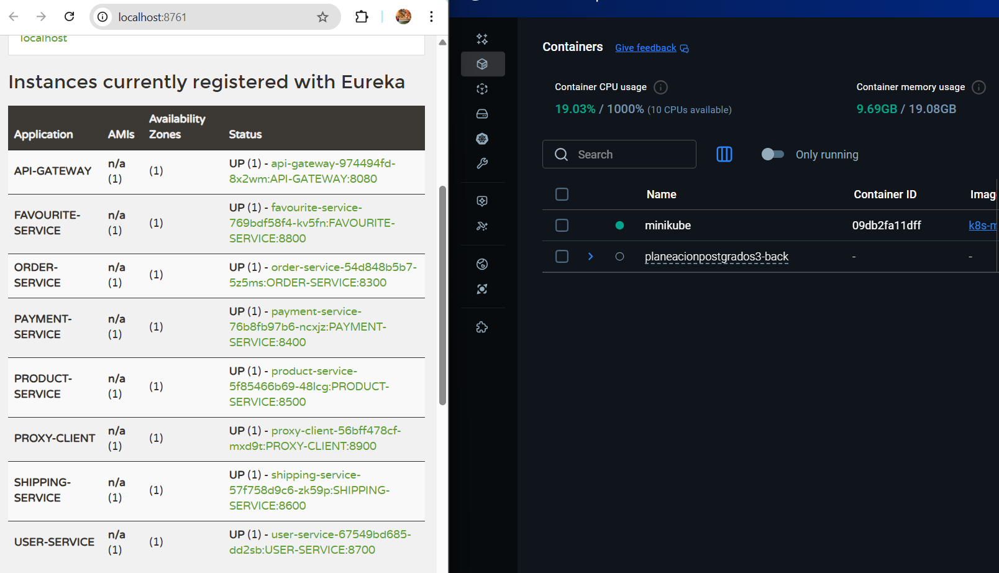
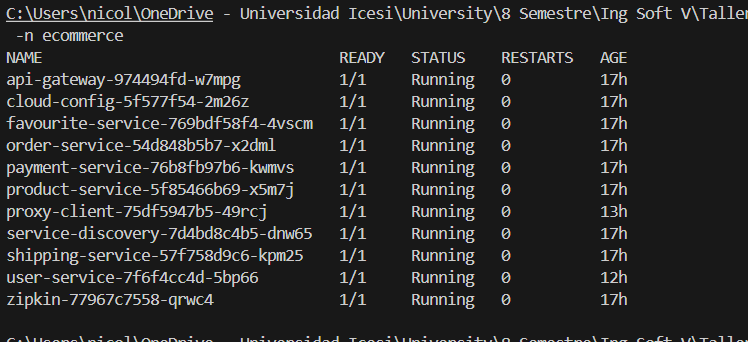

# 🚀 E-Commerce Microservices - Proyecto de Ingeniería de Software V

## 📋 Información del Proyecto

Este proyecto es un **fork** del repositorio original [ecommerce-microservice-backend-app](https://github.com/SelimHorri/ecommerce-microservice-backend-app) de **Selim Horri**. La documentación completa de la versión base y su arquitectura original se encuentra en [selim-version.md](./docs/initial-part/selim-version.md).

A partir de esta base, se realizaron múltiples mejoras, correcciones arquitectónicas, implementación de pipelines CI/CD, y despliegue en diferentes entornos (Docker Compose y Kubernetes/Minikube y Azure).

---

## 🎯 Objetivos del Proyecto

1. **Desplegar** una arquitectura de microservicios completa usando contenedores
2. **Corregir** problemas arquitectónicos de la versión original
3. **Implementar** testing completo (unitario, integración, E2E)
4. **Automatizar** el ciclo de vida con pipelines CI/CD
5. **Documentar** todo el proceso de despliegue y configuración

---

## 📊 Arquitectura del Sistema

### **System Boundary - Microservices Landscape**


### **Componentes Principales:**

- **Service Discovery (Eureka)**: Registro y descubrimiento de servicios
- **Cloud Config**: Configuración centralizada
- **API Gateway**: Punto de entrada único al sistema
- **Proxy Client**: Autenticación y autorización
- **Zipkin**: Trazabilidad distribuida
- **8 Microservicios de Negocio**:
  - User Service
  - Product Service
  - Order Service
  - Payment Service
  - Shipping Service
  - Favourite Service
  - Cart Service (integrado en Order)

### **Modelo de Datos - Entity Relationship Diagram**


---

## 🔄 Evolución del Proyecto

### **Fase 1: Despliegue con Docker Compose**

El primer paso fue desplegar todos los microservicios usando Docker Compose para validar la arquitectura base y comprender las interacciones entre servicios.

#### **Configuración Docker Compose**

**Dashboard de Eureka - Servicios Registrados:**


*Todos los microservicios registrados en Eureka Service Discovery*

**Zipkin - Trazabilidad Distribuida:**


*Visualización de trazas distribuidas de las peticiones HTTP*

#### **Arquitectura Docker Compose:**

```yaml
services:
  - service-discovery (Eureka)
  - cloud-config
  - api-gateway
  - proxy-client
  - zipkin
  - user-service
  - product-service
  - order-service
  - payment-service
  - shipping-service
  - favourite-service
```

**Comandos utilizados:**

```bash
# Build de todos los servicios
./mvnw clean package -DskipTests

# Levantar toda la infraestructura
docker-compose -f compose.yml up -d

# Verificar servicios
docker-compose ps
```

**Resultados:**
- ✅ Todos los servicios se comunicaron correctamente
- ✅ Eureka registró todos los microservicios
- ✅ Zipkin capturó las trazas distribuidas
- ⚠️ Se identificaron problemas arquitectónicos con el routing del API Gateway

---

### **Fase 2: Migración a Kubernetes (Minikube)**

Después de validar la arquitectura con Docker Compose, se procedió a desplegar en Kubernetes usando Minikube. Este proceso se documentó completamente en [DEPLOYMENT_GUIDE.md](docs/initial-part/deployment-guide-minikube.md).

#### **Despliegue en Minikube**

**Minikube Dashboard - Namespace ecommerce:**



*Vista general del namespace ecommerce en Kubernetes*

**Pods desplegados:**



*Todos los pods running en el namespace ecommerce*

**Services expuestos:**


*ClusterIP services para comunicación interna*

#### **Proceso de Despliegue:**

```bash
# 1. Iniciar Minikube
minikube start --driver=docker --cpus=4 --memory=16384

# 2. Configurar Docker para usar Minikube
& minikube -p minikube docker-env --shell powershell | Invoke-Expression

# 3. Build de imágenes Docker
./build-images.ps1

# 4. Deploy en orden de dependencias
kubectl apply -f k8s/base/namespace.yaml
kubectl apply -f k8s/base/configmaps.yaml
kubectl apply -f k8s/base/zipkin.yaml
kubectl apply -f k8s/base/service-discovery.yaml
kubectl apply -f k8s/base/cloud-config.yaml
kubectl apply -f k8s/base/api-gateway.yaml
kubectl apply -f k8s/base/proxy-client.yaml
kubectl apply -f k8s/base/

# 5. Verificar deployment
kubectl get pods -n ecommerce
kubectl get svc -n ecommerce
```

#### **Arquitectura en Kubernetes:**

- **Namespace dedicado**: `ecommerce`
- **ConfigMaps**: Configuraciones centralizadas
- **Services**: ClusterIP para comunicación interna
- **Deployments**: 1 réplica por servicio (ajustable)
- **Resources**: Limits y requests configurados

---

### **Fase 3: Despliegue en Azure**
---

## 👥 Equipo

**Autor del Fork:** Nicolás Cuéllar Molina

**Compañero de Trabajo:** Samuel Álvarez Albán

**Universidad:** Universidad Icesi

**Curso:** Ingeniería de Software V

**Semestre:** 8vo Semestre

**Año:** 2025

**Proyecto Original:** [Selim Horri - ecommerce-microservice-backend-app](https://github.com/SelimHorri/ecommerce-microservice-backend-app)

---

## 📄 Licencia

Este proyecto mantiene la misma licencia del proyecto original.

---

## 📞 Contacto

Para preguntas, sugerencias o reportar problemas:
- **GitHub Issues**: [Crear Issue](https://github.com/Nicolas-CM/ecommerce-microservice-backend-app/issues)
- **Email**: nicolascuellar.molina@gmail.com

---

**⭐ Si este proyecto te fue útil, dale una estrella en GitHub!**
