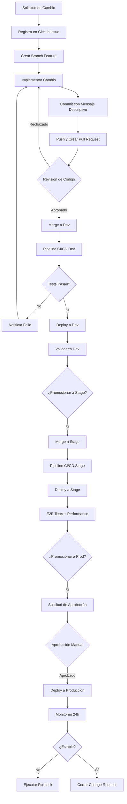

[🏠 Volver al README](../../README.md#proceso-de-gestión-de-cambios)

---

# Change Management Process
## Proceso Formal de Gestión de Cambios

> **Proyecto**: E-commerce Microservices Backend  
> **Versión**: 1.0  
> **Fecha**: Diciembre 2025  
> **Responsable**: Equipo DevOps

---

## 📋 Índice

1. [Introducción](#introducción)
2. [Flujo de Gestión de Cambios](#flujo-de-gestión-de-cambios)
3. [Registro de Cambios](#registro-de-cambios)
4. [Revisión y Aprobación](#revisión-y-aprobación)
5. [Validación Automática](#validación-automática)
6. [Promoción por Ambientes](#promoción-por-ambientes)
7. [Despliegue Controlado](#despliegue-controlado)
8. [Trazabilidad Completa](#trazabilidad-completa)
9. [Monitoreo Post-Despliegue](#monitoreo-post-despliegue)
10. [Matriz de Responsabilidades](#matriz-de-responsabilidades)

---

## 🎯 Introducción

Este documento define el proceso formal de gestión de cambios (Change Management) para el proyecto de microservicios de e-commerce. El objetivo es garantizar que todos los cambios en el sistema sean:

- **Documentados**: Con motivo y alcance claramente definidos
- **Revisados**: Por pares técnicos antes de su integración
- **Validados**: Automáticamente por pipelines de CI/CD
- **Controlados**: Con aprobaciones explícitas en ambientes críticos
- **Trazables**: Con historial completo de versiones y artefactos
- **Monitoreados**: Con seguimiento post-despliegue de métricas

---

## 🔄 Flujo de Gestión de Cambios



---

## 📝 Registro de Cambios

### 1.1 Documentación Obligatoria

**Cada cambio debe registrarse con:**

#### GitHub Issue
```markdown
**Tipo de Cambio**: [Feature | Bugfix | Hotfix | Security | Performance]

**Motivo del Cambio**:
- Descripción clara del problema o mejora
- Justificación técnica o de negocio
- Usuarios/sistemas afectados

**Alcance del Cambio**:
- Microservicios impactados: [api-gateway, user-service, ...]
- Cambios en base de datos: [Sí/No] - Detallar
- Cambios en infraestructura: [Sí/No] - Detallar
- Impacto en APIs públicas: [Sí/No] - Versiones afectadas

**Estimación**:
- Esfuerzo: [Horas/Story Points]
- Riesgo: [Alto/Medio/Bajo]
- Ventana de despliegue: [Fecha/Hora]

**Testing Requerido**:
- [ ] Unit Tests
- [ ] Integration Tests
- [ ] E2E Tests
- [ ] Performance Tests
- [ ] Security Scan

**Rollback Plan**:
- Estrategia de reversión definida: [Sí/No]
- Versión anterior estable: [vX.Y.Z]
```

### 1.2 Commits Estructurados

**Formato de mensaje de commit:**
```
<tipo>(<alcance>): <descripción breve>

<cuerpo del mensaje explicando el cambio>

Refs: #<número-issue>
Breaking Changes: [Sí/No]
```

**Tipos permitidos:**
- `feat`: Nueva funcionalidad
- `fix`: Corrección de bug
- `perf`: Mejora de rendimiento
- `refactor`: Refactorización de código
- `test`: Adición o modificación de tests
- `docs`: Cambios en documentación
- `chore`: Tareas de mantenimiento
- `security`: Corrección de vulnerabilidad

**Ejemplo:**
```
feat(user-service): implementar autenticación OAuth2

- Integrar Spring Security OAuth2
- Configurar cliente GitHub OAuth
- Agregar endpoints /oauth2/authorization
- Actualizar tests de seguridad

Refs: #156
Breaking Changes: No
```

---

## 🔍 Revisión y Aprobación

### 2.1 Pull Request Obligatorio

**Requisitos para crear PR:**

1. **Título descriptivo** siguiendo convención de commits
2. **Descripción completa** con:
   - Resumen de cambios
   - Screenshots/logs si aplica
   - Checklist de validación
3. **Link al Issue** relacionado
4. **Labels apropiados**: `feature`, `bugfix`, `security`, etc.
5. **Reviewers asignados**: Mínimo 1 revisor técnico

### 2.2 Proceso de Revisión

#### Criterios de Aprobación

**Code Review Checklist:**

```markdown
## Funcionalidad
- [ ] El código cumple con los requisitos del issue
- [ ] La lógica es correcta y eficiente
- [ ] Maneja casos edge y errores apropiadamente

## Calidad de Código
- [ ] Sigue estándares de código del proyecto
- [ ] Nombres de variables/métodos son descriptivos
- [ ] Código es legible y bien estructurado
- [ ] Sin código duplicado o dead code

## Testing
- [ ] Tests unitarios con cobertura >80%
- [ ] Tests de integración si aplica
- [ ] Tests pasan localmente y en CI

## Seguridad
- [ ] Sin hardcoded secrets o credenciales
- [ ] Validación de inputs de usuario
- [ ] Sin vulnerabilidades conocidas

## Performance
- [ ] Sin queries N+1 o loops ineficientes
- [ ] Uso apropiado de caché
- [ ] Sin memory leaks evidentes

## Documentación
- [ ] Javadoc/comentarios en código complejo
- [ ] README actualizado si aplica
- [ ] API documentation actualizada
```

#### Roles de Revisión

| Rol | Responsabilidad | Cantidad |
|-----|-----------------|----------|
| **Tech Lead** | Aprobación arquitectural y técnica | 1 obligatorio |
| **Peer Developer** | Revisión de código y lógica | 1 obligatorio |
| **Security Champion** | Revisión de seguridad (cambios sensibles) | Opcional |
| **QA Engineer** | Validación de criterios de aceptación | Opcional |

### 2.3 Políticas de Merge

**Branch Protection Rules:**

```yaml
Ramas Protegidas: [master, stage, dev]

Reglas:
  - Require pull request reviews: 1 aprobación mínimo
  - Require status checks to pass:
    - maven-build ✓
    - trivy-scan ✓
    - sonarqube-analysis ✓
  - Require branches to be up to date: true
  - Require conversation resolution: true
  - Dismiss stale reviews: true
  - Restrict who can push: Tech Leads, DevOps
```

---

## ✅ Validación Automática

### 3.1 Pipeline de CI/CD

**Validaciones Pre-Merge:**

#### 1. Build & Unit Tests
```yaml
Paso: maven-build
Objetivo: Compilar código y ejecutar tests unitarios
Criterio de Éxito:
  - Build exitoso sin errores de compilación
  - Todos los unit tests pasan (0 fallos)
  - Cobertura de código >80%
Tiempo: ~5 minutos
```

#### 2. SonarQube Analysis
```yaml
Paso: sonarqube-scan
Objetivo: Análisis estático de calidad y seguridad
Criterio de Éxito:
  - Quality Gate: PASSED
  - Bugs: 0 nuevos
  - Vulnerabilities: 0 CRITICAL/HIGH
  - Code Smells: <5 nuevos
  - Duplicación: <3%
  - Coverage: >80%
Tiempo: ~3 minutos
```

#### 3. Security Scanning (Trivy)
```yaml
Paso: trivy-scan
Objetivo: Detectar vulnerabilidades en dependencias y configuraciones
Criterios:
  - trivy-filesystem: Sin CRITICAL
  - trivy-config: Sin misconfiguraciones CRITICAL
  - trivy-image: Sin CVEs con CVSS >9.0
Tiempo: ~2 minutos
```

#### 4. OWASP Dependency Check
```yaml
Paso: owasp-dependency-check
Objetivo: Escanear dependencias Maven
Criterio de Éxito:
  - Sin CVEs con CVSS ≥9.0
  - Dependencias actualizadas
Tiempo: ~10 minutos (con NVD API Key)
```

### 3.2 Validaciones Post-Merge (Dev)

#### 5. Integration Tests
```yaml
Paso: integration-tests
Objetivo: Validar integración entre microservicios
Cobertura:
  - API contract tests
  - Database integration
  - Service-to-service communication
Criterio: 100% tests pasan
Tiempo: ~8 minutos
```

#### 6. E2E Tests (Stage)
```yaml
Paso: e2e-tests
Objetivo: Validar flujos completos de usuario
Herramienta: Newman (Postman Collections)
Escenarios:
  - Registro y login de usuario
  - Crear orden completa
  - Procesar pago
  - Gestionar favoritos
Criterio: Todos los escenarios exitosos
Tiempo: ~5 minutos
```

#### 7. Performance Tests (Stage)
```yaml
Paso: performance-tests
Objetivo: Validar rendimiento bajo carga
Herramienta: Locust
Configuración:
  - Usuarios concurrentes: 50
  - Duración: 5 minutos
  - Ramp-up: 10 usuarios/segundo
Criterios:
  - Response time P95: <500ms
  - Error rate: <1%
  - Throughput: >100 req/s
Tiempo: ~7 minutos
```

#### 8. OWASP ZAP Security Scan (Stage)
```yaml
Paso: owasp-zap-scan
Objetivo: DAST (Dynamic Application Security Testing)
Tipo: Baseline scan
Criterios:
  - Sin alertas CRITICAL
  - Alertas HIGH: <3
Target: API Gateway público
Tiempo: ~10 minutos
```

---

## 🚀 Promoción por Ambientes

### 4.1 Estrategia de Ambientes

```
┌─────────────┐     ┌─────────────┐     ┌─────────────┐
│     DEV     │────▶│    STAGE    │────▶│    PROD     │
│  (develop)  │     │   (stage)   │     │  (master)   │
└─────────────┘     └─────────────┘     └─────────────┘
     Auto                Auto              Manual
   Continuous          Continuous        Controlled
  Integration         Delivery          Deployment
```

### 4.2 Flujo de Promoción

#### DEV → Desarrollo Activo
**Trigger**: Merge a branch `dev`

**Características:**
- Despliegue automático continuo
- Testing frecuente
- Datos de prueba sintéticos
- Ambiente inestable permitido
- Sin aprobación manual

**Pipeline:**
```yaml
1. Build & Unit Tests
2. SonarQube Scan
3. Trivy Security Scan
4. Docker Build & Push (tag: dev)
5. Deploy to AKS namespace: ecommerce-dev
6. Integration Tests
7. Notificación: Slack/Email
```

**Namespace Kubernetes**: `ecommerce-dev`  
**Image Tags**: `<service>:dev`, `<service>:dev-<commit-sha>`  
**Réplicas**: 1 por servicio  
**Recursos**: Mínimos (requests: 256Mi RAM, 250m CPU)

---

#### STAGE → Pre-Producción
**Trigger**: Merge a branch `stage`

**Características:**
- Despliegue automático
- Ambiente similar a producción
- Datos anonimizados de producción
- Testing exhaustivo (E2E + Performance)
- Sin aprobación manual, pero validación estricta

**Pipeline:**
```yaml
1. Build & Unit Tests (reuso de artifacts)
2. Trivy Image Scan
3. Docker Tag from Dev (tag: stage)
4. Deploy to AKS namespace: ecommerce-stage
5. Wait for Rollout Complete
6. E2E Tests (Newman)
7. Performance Tests (Locust)
8. OWASP ZAP Security Scan
9. Generate Release Candidate
10. Notificación: Equipo completo
```

**Namespace Kubernetes**: `ecommerce-stage`  
**Image Tags**: `<service>:stage`, `<service>:stage-<version>`  
**Réplicas**: 2 por servicio  
**Recursos**: Similares a producción

**Quality Gates:**
- ✅ Todos los E2E tests pasan
- ✅ Performance dentro de SLAs
- ✅ Sin vulnerabilidades CRITICAL
- ✅ Health checks OK por 10 minutos

---

#### PROD → Producción
**Trigger**: Workflow dispatch manual o merge a `master`

**Características:**
- Despliegue controlado con aprobación obligatoria
- Ambiente productivo con usuarios reales
- Zero-downtime deployment
- Rollback plan obligatorio
- Monitoreo 24h post-despliegue

**Pipeline:**
```yaml
1. Request Approval (Email notification)
2. Manual Approval (GitHub Environment: prod)
3. Azure Login & AKS Context
4. Create/Update namespace: prod
5. Helm Deploy with image-tags-prod.yaml
6. Rollout Status Verification
7. Health Check Validation
8. Generate Production Release (GitHub)
9. Post-Deploy Monitoring Alert
10. Success/Failure Notification
```

**Namespace Kubernetes**: `prod`  
**Image Tags**: `<service>:0.1.0-prod-multi` (multi-arch)  
**Réplicas**: 3-5 por servicio (con HPA)  
**Recursos**: Optimizados para producción

**Aprobación Requerida:**
- ✅ Tech Lead o Product Owner
- ✅ Change Request aprobado
- ✅ Rollback plan documentado
- ✅ Ventana de mantenimiento coordinada

---

## 🎛️ Despliegue Controlado

### 5.1 Producción - Aprobación Manual

**GitHub Environment Protection:**
```yaml
Environment: prod
Protections:
  - Required Reviewers: 
      - Tech Lead
      - DevOps Engineer
  - Wait Timer: 0 minutos
  - Deployment Branches: master only
```

### 5.2 Notificación de Aprobación

**Email enviado a aprobadores:**
```
Asunto: Production deploy approval needed - ecommerce-microservice-backend-app

Production deployment is awaiting approval.

Repository: Nicolas-CM/ecommerce-microservice-backend-app
Branch: master
Commit: 33b518f
Workflow: CI-CD Prod - Full Validation & Deploy

Microservice image tags for production:
cloud-config: "0.1.0-prod-multi" | service-discovery: "0.1.0-prod-multi" | 
api-gateway: "0.1.0-prod-multi" | ...

Please review the changes and approve or reject the deployment.
Link: https://github.com/.../actions/runs/...
```

### 5.3 Criterios de Aprobación

**Checklist de Aprobación:**

```markdown
## Pre-Deployment Validation
- [ ] Change Request aprobado formalmente
- [ ] Stage environment validado exitosamente
- [ ] Performance tests dentro de SLAs
- [ ] Security scans sin findings críticos
- [ ] Rollback plan documentado y revisado
- [ ] Team notification enviada (on-call)
- [ ] Backup de base de datos completado (si aplica)
- [ ] Ventana de mantenimiento confirmada
- [ ] Post-deployment runbook preparado

## Release Information
- [ ] Release notes generadas y revisadas
- [ ] Breaking changes identificados y comunicados
- [ ] API versioning correcto
- [ ] Database migrations testeadas

## Monitoring & Observability
- [ ] Dashboards de monitoreo actualizados
- [ ] Alertas configuradas para nuevos servicios
- [ ] Logs correctamente estructurados
- [ ] Distributed tracing funcional
```

### 5.4 Estrategia de Despliegue

**Rolling Update (Kubernetes):**
```yaml
Strategy:
  type: RollingUpdate
  rollingUpdate:
    maxUnavailable: 25%
    maxSurge: 1

Proceso:
  1. Helm upgrade aplica nuevos manifiestos
  2. Kubernetes crea pods con nueva imagen
  3. Health checks validan nuevos pods
  4. Tráfico se migra gradualmente
  5. Pods antiguos se terminan gracefully
  6. Rollout completo en ~5 minutos
```

**Verificación Post-Despliegue:**
```bash
# Validar estado de pods
kubectl get pods -n prod
# Todos deben estar 1/1 Running

# Validar servicios y endpoints
kubectl get svc,endpoints -n prod

# Revisar logs recientes
kubectl logs -n prod deployment/api-gateway --tail=50

# Ejecutar health checks
for svc in api-gateway user-service product-service; do
  curl http://<LB-IP>:8080/$svc/actuator/health
done
```

---

## 📊 Trazabilidad Completa

### 6.1 Versionado de Artefactos

**Docker Images (GHCR):**
```
ghcr.io/nicolas-cm/<service>:<tag>

Tags utilizados:
  - dev                    # Último build de dev
  - dev-<commit-sha>       # Build específico de dev
  - stage                  # Release candidate
  - stage-<version>        # RC con versión semántica
  - latest                 # Última versión estable
  - 0.1.0-prod-multi       # Producción multi-arch
  - <version>-<date>       # Versión con timestamp
```

**Ejemplo de historial:**
```
ghcr.io/nicolas-cm/user-service:0.1.0-prod-multi  (2025-12-01)
ghcr.io/nicolas-cm/user-service:stage-0.1.0       (2025-11-30)
ghcr.io/nicolas-cm/user-service:dev-33b518f       (2025-11-29)
```

### 6.2 GitHub Releases

**Formato de Release:**
```
Tag: prod-2025.12.01-33b518f
Title: Production Release 2025.12.01-33b518f

## Image Tags
  - cloud-config: "0.1.0-prod-multi"
  - service-discovery: "0.1.0-prod-multi"
  - api-gateway: "0.1.0-prod-multi"
  ...

## Changes
- feat(user-service): OAuth2 authentication (a1b2c3d)
- fix(order-service): race condition in inventory (d4e5f6g)
- perf(api-gateway): optimize routing rules (g7h8i9j)

Deployed: 2025-12-01 04:30:00 UTC
Commit: 33b518f42a9d87fe6849850cfd9532b424bd34ae
Branch: master
```

### 6.3 Artifacts de Pipeline

**GitHub Actions Artifacts (30 días retención):**

| Artifact | Contenido | Uso |
|----------|-----------|-----|
| `build-artifacts` | JARs compilados, reports JaCoCo | Debugging, auditoría |
| `test-results` | Reportes Surefire XML | Análisis de fallos |
| `trivy-*-scan` | Reportes SARIF de seguridad | Security tab GitHub |
| `dependency-check-reports` | HTML/XML/JSON CVE reports | Auditoría de vulnerabilidades |
| `e2e-test-results` | Newman HTML reports | Validación funcional |
| `performance-test-results` | Locust CSV/HTML | Análisis de rendimiento |
| `zap-scan-results` | OWASP ZAP HTML/JSON | Auditoría DAST |
| `prod-release-notes` | Changelog markdown | Documentación release |

### 6.4 Helm Chart Versions

**Gestión de versiones:**
```yaml
Chart.yaml:
  version: 0.1.0
  appVersion: "2025.12.01"

values-prod.yaml:
  domain: "cuellarapp.online"
  environment: prod

image-tags-prod.yaml:
  imageTags:
    cloud-config: "0.1.0-prod-multi"
    api-gateway: "0.1.0-prod-multi"
    ...
```

**Historial de deploys:**
```bash
helm history ecommerce-app -n prod

REVISION  UPDATED                   STATUS      CHART                APP VERSION
1         2025-11-28 20:15:30 UTC   superseded  ecommerce-chart-0.1.0  2025.11.28
2         2025-11-29 15:42:18 UTC   superseded  ecommerce-chart-0.1.0  2025.11.29
3         2025-12-01 04:30:45 UTC   deployed    ecommerce-chart-0.1.0  2025.12.01
```

### 6.5 Trazabilidad End-to-End

**Tracking de un cambio completo:**

```
1. GitHub Issue #156
   ↓
2. Branch: feature/oauth2-auth
   ↓
3. Commits: a1b2c3d, d4e5f6g, g7h8i9j
   ↓
4. Pull Request #158
   ↓
5. Code Review (aprobado por @tech-lead)
   ↓
6. Merge to dev (auto-deploy)
   ↓
7. Dev Pipeline Run #1234
   ↓
8. Docker Image: user-service:dev-33b518f
   ↓
9. Merge to stage
   ↓
10. Stage Pipeline Run #1235
    ↓
11. E2E Tests (passed)
    ↓
12. Docker Image: user-service:stage-0.1.0
    ↓
13. Merge to master
    ↓
14. Production Approval Request
    ↓
15. Manual Approval (approved by @product-owner)
    ↓
16. Prod Pipeline Run #1236
    ↓
17. Helm Deploy (revision 3)
    ↓
18. Docker Image: user-service:0.1.0-prod-multi
    ↓
19. GitHub Release: prod-2025.12.01-33b518f
    ↓
20. Monitoring Dashboard (24h observation)
```

---

## 📈 Monitoreo Post-Despliegue

### 7.1 Ventana de Observación

**Protocolo 24h:**

| Periodo | Acción | Frecuencia |
|---------|--------|------------|
| **0-1h** | Monitoreo activo continuo | Cada 5 minutos |
| **1-4h** | Revisión de métricas y logs | Cada 15 minutos |
| **4-12h** | Validación de estabilidad | Cada 30 minutos |
| **12-24h** | Seguimiento normal | Cada 2 horas |

### 7.2 Métricas Clave (Golden Signals)

#### 1. Latencia
```
Métrica: Response Time P95
Umbral Normal: <500ms
Alerta: >800ms
Crítico: >1500ms

Monitoreo:
  - Prometheus: http_server_requests_seconds{quantile="0.95"}
  - Dashboard: Grafana - API Response Times
```

#### 2. Tráfico
```
Métrica: Requests per Second
Umbral Normal: 50-200 req/s
Alerta: >300 req/s o <10 req/s
Crítico: >500 req/s o <5 req/s

Monitoreo:
  - Prometheus: rate(http_server_requests_total[5m])
  - Dashboard: Grafana - Throughput
```

#### 3. Errores
```
Métrica: Error Rate
Umbral Normal: <1%
Alerta: >2%
Crítico: >5%

Monitoreo:
  - Prometheus: rate(http_server_requests_total{status=~"5.."}[5m])
  - Dashboard: Grafana - Error Rates
```

#### 4. Saturación
```
Métricas:
  - CPU Usage: <70% normal, >85% alerta
  - Memory Usage: <80% normal, >90% alerta
  - Pod Restarts: 0 esperado, >1 alerta

Monitoreo:
  - Prometheus: container_cpu_usage_seconds_total
  - Kubernetes: kubectl top pods -n prod
```

### 7.3 Health Checks

**Endpoints de Salud:**
```bash
# Liveness - ¿El pod está vivo?
GET /actuator/health/liveness
Expected: {"status": "UP"}

# Readiness - ¿El pod puede recibir tráfico?
GET /actuator/health/readiness
Expected: {"status": "UP"}

# Overall Health
GET /actuator/health
Expected: {
  "status": "UP",
  "components": {
    "db": {"status": "UP"},
    "diskSpace": {"status": "UP"},
    "ping": {"status": "UP"}
  }
}
```

### 7.4 Log Analysis

**Revisión de Logs Post-Deploy:**

```bash
# Verificar logs de todos los servicios
kubectl logs -n prod -l app.kubernetes.io/component=microservice --tail=100

# Buscar errores recientes
kubectl logs -n prod -l app.kubernetes.io/component=microservice --since=1h | grep -i error

# Verificar logs de API Gateway
kubectl logs -n prod deployment/api-gateway -f

# Buscar excepciones específicas
kubectl logs -n prod --all-containers=true | grep -i "exception\|error\|fatal"
```

**Patrones a Buscar:**
- ❌ `OutOfMemoryError`
- ❌ `Connection refused`
- ❌ `Timeout`
- ❌ `NullPointerException`
- ⚠️ `WARN` en frecuencia alta
- ✅ Ausencia de errores críticos

### 7.5 Alertas Configuradas

**Azure Monitor / Prometheus Alerts:**

```yaml
Alertas Críticas (PagerDuty):
  - Pod CrashLoopBackOff (>2 restarts en 5 min)
  - Service Down (health check failed)
  - Error Rate >5%
  - Response Time P95 >2s
  - Database Connection Pool Exhausted

Alertas de Warning (Slack):
  - Error Rate >2%
  - Response Time P95 >800ms
  - CPU Usage >85%
  - Memory Usage >90%
  - Disk Space <20%

Alertas Informativas (Email):
  - Deployment completado exitosamente
  - Scaling event (HPA triggered)
  - Certificate expiring (<30 days)
```

### 7.6 Runbook Post-Despliegue

**Checklist de Verificación (30 min post-deploy):**

```markdown
## Infrastructure Health
- [ ] Todos los pods están Running (1/1 Ready)
- [ ] No hay pods en CrashLoopBackOff o Error
- [ ] LoadBalancer tiene IP externa asignada
- [ ] Ingress está recibiendo tráfico

## Application Health
- [ ] Health checks responden 200 OK
- [ ] Logs no muestran errores críticos
- [ ] Métricas de latencia dentro de rangos
- [ ] Error rate <1%

## Database & Dependencies
- [ ] Conexiones a base de datos activas
- [ ] Migraciones aplicadas correctamente
- [ ] Redis/Cache funcionando
- [ ] Message queues (si aplica) operacionales

## Monitoring & Observability
- [ ] Dashboards Grafana actualizados
- [ ] Prometheus scraping metrics
- [ ] Alertas configuradas y activas
- [ ] Distributed tracing operacional (Zipkin/Jaeger)

## Business Metrics
- [ ] Transacciones completándose exitosamente
- [ ] Usuarios pueden autenticarse
- [ ] Operaciones CRUD funcionando
- [ ] Flujos críticos de negocio OK
```

---

## 👥 Matriz de Responsabilidades

### RACI Matrix

| Actividad | Dev | Tech Lead | DevOps | QA | Product Owner |
|-----------|-----|-----------|--------|----|--------------| 
| Crear Issue | R/A | C | I | C | C |
| Implementar Cambio | R/A | C | I | I | I |
| Code Review | C | R/A | I | C | I |
| Merge a Dev | R/A | C | C | I | I |
| Validar en Stage | C | C | I | R/A | C |
| Aprobar Prod Deploy | I | R/A | C | I | R/A |
| Ejecutar Deploy Prod | I | C | R/A | I | I |
| Monitoreo Post-Deploy | C | C | R/A | I | I |
| Rollback Decision | I | C/R | R/A | I | R/A |
| Documentar Cambio | R/A | C | C | C | I |

**Leyenda:**
- **R** (Responsible): Ejecuta la tarea
- **A** (Accountable): Aprueba/responde por el resultado
- **C** (Consulted): Proporciona input
- **I** (Informed): Mantiene informado

---

## 📚 Referencias

- [GitHub Flow](https://docs.github.com/en/get-started/quickstart/github-flow)
- [Semantic Versioning](https://semver.org/)
- [ITIL Change Management](https://www.axelos.com/best-practice-solutions/itil)
- [GitLab CI/CD Documentation](https://docs.gitlab.com/ee/ci/)
- [Kubernetes Rolling Updates](https://kubernetes.io/docs/tutorials/kubernetes-basics/update/update-intro/)

---

## 📝 Historial de Cambios del Documento

| Versión | Fecha | Autor | Cambios |
|---------|-------|-------|---------|
| 1.0 | 2025-12-01 | DevOps Team | Versión inicial del proceso |

---

**Documento Controlado** - Requiere aprobación para modificaciones

[🏠 Volver al README](../../README.md#proceso-de-gestión-de-cambios)
