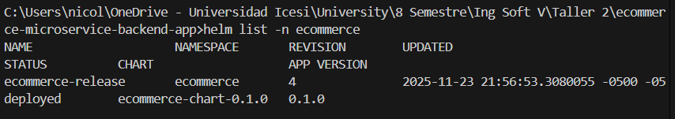
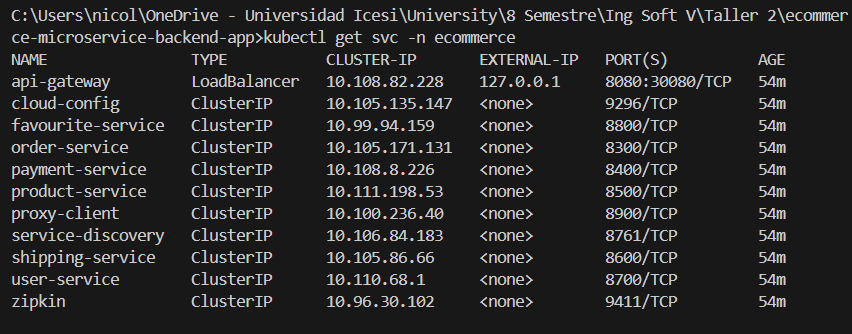

## [Volver al README](../../README.md)

# Despliegue de Microservicios con Helm en Minikube

Este documento detalla el proceso de despliegue de la arquitectura de microservicios utilizando **Helm** en un entorno local con **Minikube**. El objetivo es estandarizar y simplificar el despliegue para facilitar la futura migración a **Azure Kubernetes Service (AKS)**.

## ¿Qué es Helm?

Helm es el gestor de paquetes para Kubernetes. Permite definir, instalar y actualizar aplicaciones de Kubernetes, incluso las más complejas. Helm utiliza un formato de empaquetado llamado **Charts**.

### Beneficios de usar Helm
*   **Gestión de Complejidad**: Permite describir aplicaciones complejas con múltiples recursos (Deployments, Services, ConfigMaps) en un solo paquete.
*   **Actualizaciones Sencillas**: Facilita la actualización de aplicaciones y permite realizar rollbacks (volver a versiones anteriores) fácilmente.
*   **Reutilización**: Los Charts pueden ser compartidos y reutilizados en diferentes entornos (Dev, QA, Prod) simplemente cambiando el archivo de configuración (`values.yaml`).
*   **Estandarización**: Provee una estructura común para definir servicios.

### Conceptos Claves
*   **Chart**: Un paquete de Helm. Contiene todas las definiciones de recursos necesarias para ejecutar una aplicación, herramienta o servicio dentro de un clúster de Kubernetes.
*   **Repository**: Un lugar donde se pueden recopilar y compartir Charts.
*   **Release**: Una instancia de un Chart ejecutándose en un clúster de Kubernetes. Se puede instalar el mismo Chart varias veces creando diferentes Releases.
*   **Values (`values.yaml`)**: Archivo de configuración que permite personalizar el comportamiento del Chart sin modificar sus plantillas. Aquí definimos imágenes, puertos y variables de entorno específicas.

## Ejecución y Despliegue

Para desplegar la aplicación, utilizamos el comando `helm upgrade --install`. Este comando es idempotente: si el release no existe, lo instala; si ya existe, lo actualiza con los nuevos cambios.

### Comando de Instalación/Actualización

```bash
helm upgrade --install ecommerce-release ./k8s/helm/ecommerce-chart -n ecommerce --create-namespace
```

*   `ecommerce-release`: Nombre del Release.
*   `./k8s/helm/ecommerce-chart`: Ruta al directorio del Chart.
*   `-n ecommerce`: Namespace donde se desplegará.

### Verificación del Despliegue

Una vez ejecutado, podemos listar los releases instalados para confirmar que `ecommerce-release` está desplegado:



También podemos verificar que los servicios de Kubernetes se han creado correctamente:



## Acceso Externo y LoadBalancer (Minikube Tunnel)

En un entorno de nube real como Azure, un servicio de tipo `LoadBalancer` asignaría automáticamente una IP pública. Sin embargo, en **Minikube**, los LoadBalancers no obtienen una IP externa por defecto y se quedan en estado `Pending` o no son accesibles desde el host.

Para solucionar esto y exponer el **API Gateway**, utilizamos el comando `minikube tunnel`. Este proceso crea una ruta de red desde nuestra máquina local hacia el clúster de Minikube, permitiendo que los servicios `LoadBalancer` obtengan una IP externa (simulada).

**Ejecución del túnel:**
Abrir una nueva terminal y ejecutar:
```bash
minikube tunnel
```
*Nota: Este comando debe mantenerse en ejecución mientras necesitemos acceder al servicio.*


Con el túnel activo, el `api-gateway` será accesible a través de `localhost` o la IP asignada por el túnel en el puerto configurado (ej. 8080).

## Detener y Desinstalar

Para detener la aplicación y eliminar todos los recursos creados por Helm en el namespace, ejecutamos:

```bash
helm uninstall ecommerce-release -n ecommerce
```

Esto eliminará los Deployments, Services y Pods asociados al release `ecommerce-release`.

## [Volver al README](../../README.md)
