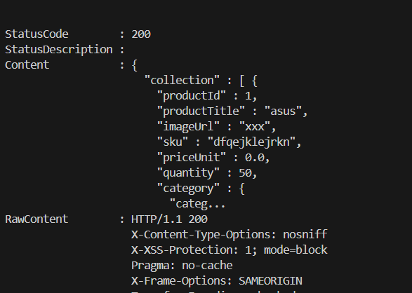
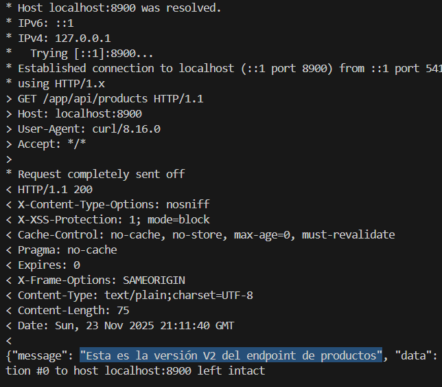

# Reporte de Patrones de Diseño Implementados o Mejorados

Este documento describe los patrones de diseño implementados en el proyecto, su propósito y los beneficios que aportan.

---

## 🛡️ Patrón de Resiliencia: Circuit Breaker

**Implementación realizada en el microservicio — `ProductClientService`**

### ✔️ Descripción del patrón

El patrón **Circuit Breaker** evita que un servicio siga llamando a otro servicio externo cuando este último está fallando de forma continua.
Funciona igual que un fusible eléctrico:

* **Si detecta muchas fallas → abre el circuito**
* **Mientras está abierto → bloquea las llamadas antes de que ocurran**
* **Después de un tiempo → intenta un estado *half-open*** para verificar si el servicio ya se recuperó

Este patrón protege al sistema, evita cascadas de fallos y mejora la **resiliencia** en arquitecturas de microservicios.

---

### ✔️ Implementación realizada

Se implementó un Circuit Breaker mediante el **fallback de Feign**, que activa una clase de respaldo cuando el microservicio `PRODUCT-SERVICE` no responde o está caído.

### **Clase:** `ProductClientService`

#### Fragmento relevante:

```java
@FeignClient(
    name = "PRODUCT-SERVICE",
    contextId = "productClientService",
    path = "/product-service/api/products",
    fallback = ProductClientService.ProductClientFallback.class
)
public interface ProductClientService {
```

### **Fallback utilizado:**

```java
@Component
class ProductClientFallback implements ProductClientService {

    @Override
    public ResponseEntity<ProductProductServiceCollectionDtoResponse> findAll() {
        throw new ResponseStatusException(
            HttpStatus.SERVICE_UNAVAILABLE,
            "PRODUCT-SERVICE no disponible (circuit breaker activado)"
        );
    }
    
    // ...se aplica el mismo fallback para findById, save, update y delete
}
```

Este fallback se ejecuta automáticamente cuando:

* El servicio remoto **no responde**
* El **timeout** expira
* El servicio está **caído**
* No se puede establecer comunicación con el servicio externo

---

### ✔️ Propósito del patrón en este proyecto

Garantizar la **resiliencia entre microservicios**, evitando que fallas en `PRODUCT-SERVICE` afecten al resto de la aplicación.

Este patrón es clave en un sistema de comercio electrónico, donde un fallo en un microservicio puede impactar procesos críticos como:

* Catálogos
* Órdenes
* Pagos
* Inventario

---

### ✔️ Beneficios obtenidos

* Aísla fallas de un microservicio para que no derriben todo el sistema
* Reduce la latencia cuando un servicio está caído (evita timeouts repetidos)
* Mejora la tolerancia a fallos
* Permite mostrar errores controlados
* Añade puntos de observabilidad al monitorear las activaciones del fallback

---

## 🧱 Patrón de Resiliencia: Bulkhead

**Implementación realizada en el microservicio — `proxy-client`**

### ✔️ Descripción del patrón

El patrón **Bulkhead** (Mamparo) aísla los recursos utilizados por diferentes partes de la aplicación para evitar que un fallo en una parte agote todos los recursos del sistema (como hilos de ejecución), afectando a otras funcionalidades.
Se inspira en los compartimentos estancos de los barcos:

* **Si un compartimento se inunda → el agua no pasa a los demás**
* **El barco sigue a flote → aunque una parte esté dañada**

En software, esto significa limitar el número de llamadas concurrentes que se pueden hacer a un servicio específico.

---

### ✔️ Implementación realizada

Se implementó utilizando **Resilience4j** en el `proxy-client` para proteger las llamadas hacia el `product-service`.

### **Configuración:** `application.yml`

Se definieron límites estrictos de concurrencia:

```yaml
resilience4j:
  bulkhead:
    instances:
      productServiceBulkhead:
        maxConcurrentCalls: 50  # Máximo 50 peticiones simultáneas
        maxWaitDuration: 100ms   # Tiempo máximo de espera en cola
```

### **Clase:** `ProductController`

Se aplicó la anotación `@Bulkhead` en los endpoints del controlador:

```java
@GetMapping
@Bulkhead(name = "productServiceBulkhead", fallbackMethod = "findAllFallback")
public ResponseEntity<ProductProductServiceCollectionDtoResponse> findAll() {
    log.info("** Proxy Client: Fetching all products with Bulkhead protection **");
    return ResponseEntity.ok(this.productClientService.findAll().getBody());
}

public ResponseEntity<ProductProductServiceCollectionDtoResponse> findAllFallback(Throwable t) {
    log.error("!! Bulkhead Full: No se pueden procesar más peticiones !!");
    return ResponseEntity.status(HttpStatus.SERVICE_UNAVAILABLE).build();
}
```

---

### ✔️ Propósito del patrón en este proyecto

Proteger al `proxy-client` de ser saturado por peticiones lentas o bloqueadas hacia el `product-service`. Si el servicio de productos se vuelve lento, el Bulkhead evitará que todas las conexiones del proxy se queden esperando, permitiendo que otras operaciones del proxy sigan funcionando.

---

### ✔️ Beneficios obtenidos

* **Aislamiento de fallos:** Un servicio lento no consume todos los recursos del sistema.
* **Estabilidad:** El sistema permanece operativo incluso bajo carga pesada en componentes específicos.
* **Fail Fast:** Con un `maxWaitDuration` bajo (10ms), el sistema rechaza rápidamente el exceso de tráfico en lugar de encolarlo indefinidamente.


---

## 🚩 Patrón de Despliegue: Feature Toggle (Feature Flags)

**Implementación realizada en el microservicio — `proxy-client`**

### ✔️ Descripción del patrón

El patrón **Feature Toggle** (o Feature Flags) permite modificar el comportamiento del sistema en tiempo de ejecución sin necesidad de cambiar el código ni volver a desplegar una nueva versión de la aplicación.
Funciona como un interruptor de luz:

* **Flag OFF:** La funcionalidad nueva está oculta o desactivada.
* **Flag ON:** La funcionalidad nueva se activa instantáneamente para los usuarios.

Esto desacopla el despliegue (deployment) del lanzamiento (release) de una funcionalidad.

---

### ✔️ Implementación realizada

Se implementó un Feature Flag dinámico utilizando **Spring Cloud Config** y la anotación `@RefreshScope`.

### **Configuración:** `application.yml`

Se definió una propiedad personalizada para controlar el flag:

```yaml
features:
  enable-v2-endpoint: false # Valor por defecto (Apagado)
```

### **Clase:** `ProductController`

Se inyectó el valor del flag y se usó para decidir qué lógica ejecutar. La anotación `@RefreshScope` permite que este valor cambie en caliente si se actualiza la configuración.

```java
@RestController
@RefreshScope // Permite recargar la configuración sin reiniciar
public class ProductController {

    @Value("${features.enable-v2-endpoint:false}")
    private boolean isV2EndpointEnabled;

    @GetMapping
    public ResponseEntity<?> findAll() {
        // Lógica del Feature Toggle
        if (isV2EndpointEnabled) {
            log.info("** Feature Toggle V2 ACTIVADO: Retornando estructura nueva **");
            return ResponseEntity.ok("{\"message\": \"Esta es la versión V2 del endpoint de productos\", \"data\": []}");
        }
        
        // Lógica original (V1)
        return ResponseEntity.ok(this.productClientService.findAll().getBody());
    }
}
```

---

### ✔️ Propósito del patrón en este proyecto

Permitir probar nuevas versiones de endpoints o funcionalidades en el entorno de producción (o desarrollo) sin afectar a todos los usuarios y con la capacidad de **revertir (rollback)** instantáneamente si algo sale mal, simplemente apagando el flag.

---

### ✔️ Verificación y Pruebas (Cambio en Caliente)

Para demostrar que el cambio ocurre sin recompilar ni redesplegar la imagen Docker, se realizó la siguiente prueba en el clúster de Kubernetes:

1.  **Estado Inicial (Flag OFF):**
    Se realiza un `port-forward` al servicio:
    ```powershell
    kubectl port-forward -n ecommerce svc/proxy-client 8900:8900
    ```
    Al consultar `GET http://localhost:8900/app/api/products`, el sistema responde con la lista de productos normal (V1).

    

2.  **Activación del Flag (En Caliente):**
    Se inyecta la variable de entorno directamente en el Deployment de Kubernetes. Esto simula un cambio de configuración en el servidor y fuerza al pod a recargar su contexto con el nuevo valor, **sin necesidad de construir una nueva imagen**.

    ```powershell
    kubectl set env deployment/proxy-client FEATURES_ENABLE_V2_ENDPOINT=true -n ecommerce
    ```

3.  **Estado Final (Flag ON):**
    Sin detener el `port-forward` (o reiniciándolo si el pod cambió), se consulta nuevamente el mismo endpoint. Ahora responde con la nueva estructura JSON (V2).

    

---

### ✔️ Beneficios obtenidos

* **Despliegues más seguros:** Si la nueva funcionalidad falla, se apaga en segundos.
* **Testing en producción:** Permite probar características con un subconjunto de usuarios (Canary Releases).
* **Integración Continua:** Permite mezclar código (merge) a la rama principal aunque la funcionalidad no esté terminada, manteniéndola apagada.