[🏠 Volver al README](../../README.md#plan-de-rollback)

---

# Rollback Plan
## Plan de Reversión de Cambios en Producción

> **Proyecto**: E-commerce Microservices Backend  
> **Versión**: 1.0  
> **Fecha**: Diciembre 2025  
> **Responsable**: Equipo DevOps

---

## 📋 Índice

1. [Introducción](#introducción)
2. [Estrategia de Rollback](#estrategia-de-rollback)
3. [Procedimiento de Detección](#procedimiento-de-detección)
4. [Reversión de Versión](#reversión-de-versión)
5. [Restauración de Datos](#restauración-de-datos)
6. [Validación Post-Rollback](#validación-post-rollback)
7. [Documentación del Incidente](#documentación-del-incidente)
8. [Casos de Uso Específicos](#casos-de-uso-específicos)
9. [Mejora Continua](#mejora-continua)

---

## 🎯 Introducción

Este documento establece el plan formal de rollback (reversión) para el proyecto de microservicios de e-commerce. El objetivo es proporcionar un procedimiento claro y probado para revertir cambios en producción cuando se detectan fallos críticos.

### Principios Fundamentales

1. **Rapidez**: Minimizar el tiempo de inactividad (MTTR - Mean Time To Recovery)
2. **Seguridad**: No agravar el problema durante la reversión
3. **Completitud**: Revertir todos los componentes afectados coherentemente
4. **Trazabilidad**: Documentar cada acción tomada
5. **Aprendizaje**: Convertir incidentes en mejoras

### Niveles de Severidad

| Nivel | Descripción | Tiempo de Respuesta | Acción |
|-------|-------------|---------------------|--------|
| **SEV-1** | Sistema completamente caído o pérdida de datos | Inmediato (< 5 min) | Rollback automático + escalación |
| **SEV-2** | Funcionalidad crítica afectada (pagos, autenticación) | < 15 minutos | Rollback manual urgente |
| **SEV-3** | Degradación de rendimiento significativa | < 30 minutos | Evaluación + rollback si aplica |
| **SEV-4** | Funcionalidad menor afectada | < 2 horas | Fix forward o rollback planificado |

---

## 🚨 Estrategia de Rollback

### Tipos de Rollback

```mermaid
graph TD
    A[Detectar Fallo] --> B{Tipo de Componente}
    B -->|Aplicación| C[Rollback de Contenedor]
    B -->|Infraestructura| D[Rollback de Terraform]
    B -->|Base de Datos| E[Rollback de Migración]
    B -->|Configuración| F[Rollback de ConfigMap]
    C --> G[Validación]
    D --> G
    E --> G
    F --> G
    G --> H{¿Sistema Estable?}
    H -->|Sí| I[Documentar Incidente]
    H -->|No| J[Escalación a SEV-1]
```



### 1. Rollback de Aplicación (Kubernetes)

**Objetivo**: Revertir imagen de contenedor a versión estable anterior

**Métodos:**

#### A. Helm Rollback (Recomendado)
```bash
# Ver historial de releases
helm history ecommerce-app -n prod

# Revertir a revision anterior
helm rollback ecommerce-app -n prod

# O revertir a revision específica
helm rollback ecommerce-app <revision> -n prod
```

**Características:**
- ✅ Revierte todos los recursos coherentemente
- ✅ Mantiene configuración de Helm
- ✅ Rápido (~2-3 minutos)
- ✅ Automáticamente valida rollout

#### B. Kubectl Rollout Undo
```bash
# Ver historial de deployment
kubectl rollout history deployment/<service> -n prod

# Revertir a versión anterior
kubectl rollout undo deployment/<service> -n prod

# O revertir a revision específica
kubectl rollout undo deployment/<service> -n prod --to-revision=<num>
```

**Características:**
- ✅ Rollback granular por servicio
- ✅ Inmediato
- ⚠️ No revierte ConfigMaps/Secrets automáticamente

#### C. Re-Deploy Imagen Anterior (Manual)
```bash
# Editar image-tags-prod.yaml con versión anterior
# Luego aplicar con Helm
helm upgrade ecommerce-app ./k8s/helm/ecommerce-chart \
  -f ./k8s/helm/values-prod.yaml \
  -f ./k8s/helm/image-tags-prod.yaml \
  -n prod
```

**Características:**
- ✅ Control total sobre versión específica
- ✅ Permite rollback selectivo de servicios
- ⚠️ Más lento (~5 minutos)

---

### 2. Rollback de Infraestructura (Terraform)

**Objetivo**: Revertir cambios en recursos de Azure

#### A. Terraform Rollback a Commit Anterior
```bash
# Ir al directorio de Terraform
cd terraform/

# Ver commits recientes
git log --oneline terraform/ -n 10

# Checkout a commit anterior estable
git checkout <commit-hash> -- terraform/

# Planificar cambios
terraform plan -out=rollback.tfplan

# Revisar plan cuidadosamente
terraform show rollback.tfplan

# Aplicar rollback
terraform apply rollback.tfplan
```

#### B. Terraform State Rollback
```bash
# Ver historial de estados (si se usa remote backend con versioning)
terraform state list

# Revertir a versión anterior del state
# (Azure Storage Account con versioning habilitado)
az storage blob list \
  --account-name <storage> \
  --container-name terraform-state \
  --prefix prod.tfstate

# Descargar versión anterior
az storage blob download \
  --account-name <storage> \
  --container-name terraform-state \
  --name prod.tfstate \
  --version-id <version-id> \
  --file terraform.tfstate.backup

# Restaurar manualmente (CUIDADO: muy peligroso)
cp terraform.tfstate.backup terraform.tfstate
terraform plan
```

**⚠️ ADVERTENCIA**: Rollback de Terraform es complejo y puede causar pérdida de datos. Siempre preferir:
1. Fix forward (corregir hacia adelante)
2. Rollback incremental de recursos específicos
3. Solo en SEV-1 considerar rollback completo

---

### 3. Rollback de Base de Datos

**Objetivo**: Revertir cambios de schema o datos

#### A. Rollback de Migraciones (Flyway/Liquibase)

**Flyway Undo Migrations:**
```bash
# Ver historial de migraciones
flyway info

# Rollback (si migration tiene script undo)
flyway undo

# Ejemplo de migration con undo:
# V1__create_users.sql (forward)
U1__create_users.sql  # (undo - elimina tabla)
```

**Liquibase Rollback:**
```bash
# Ver historial de changesets
liquibase history

# Rollback a tag específico
liquibase rollback <tag>

# Rollback N changesets
liquibase rollback-count 3

# Rollback a fecha
liquibase rollback-to-date "2025-11-30"
```

#### B. Restauración desde Backup

**Azure Database for PostgreSQL:**
```bash
# Listar backups automáticos (disponibles 7-35 días)
az postgres server show \
  --resource-group <rg-name> \
  --name <server-name> \
  --query "earliestRestoreDate"

# Restaurar a punto en el tiempo (PITR)
az postgres server restore \
  --resource-group <rg-name> \
  --name <new-server-name> \
  --restore-point-in-time "2025-12-01T03:00:00Z" \
  --source-server <original-server-id>

# Tiempo estimado: 10-30 minutos
```

**Proceso Completo:**
```bash
1. Crear servidor restaurado en paralelo
2. Validar datos en servidor restaurado
3. Detener aplicación (maintenance mode)
4. Actualizar connection strings a nuevo servidor
5. Reiniciar aplicación
6. Validar funcionalidad
7. Eliminar servidor antiguo después de 24h
```

#### C. Rollback Manual (Último Recurso)

**Para cambios de datos específicos:**
```sql
-- Si se mantuvo backup manual
BEGIN TRANSACTION;

-- Revertir datos desde tabla backup
INSERT INTO users 
SELECT * FROM users_backup_20251201;

-- Validar
SELECT COUNT(*) FROM users;
SELECT COUNT(*) FROM users_backup_20251201;

-- Si correcto, commit
COMMIT;
-- Si incorrecto, rollback
ROLLBACK;
```

---

### 4. Rollback de Configuración

**Objetivo**: Revertir ConfigMaps, Secrets, o variables de ambiente

#### A. ConfigMap/Secret Rollback
```bash
# Ver historial de cambios (si se usa GitOps)
git log k8s/helm/values-prod.yaml

# Revertir archivo a versión anterior
git checkout <commit-hash> -- k8s/helm/values-prod.yaml

# Aplicar configuración anterior
kubectl apply -f k8s/base/config/configmap.yaml -n prod

# Reiniciar pods para aplicar config
kubectl rollout restart deployment/<service> -n prod
```

#### B. Azure Key Vault Secret Rollback
```bash
# Ver versiones de secret
az keyvault secret list-versions \
  --vault-name <keyvault-name> \
  --name <secret-name>

# Restaurar versión anterior
az keyvault secret set-attributes \
  --vault-name <keyvault-name> \
  --name <secret-name> \
  --version <version-id> \
  --enabled true

# Reiniciar pods para recargar secret
kubectl delete pods -l app=<service> -n prod
```

---

## 🔍 Procedimiento de Detección

### 1. Monitoreo Automático

**Alertas Críticas (Triggers de Rollback Automático):**

```yaml
Alerta: Pod CrashLoopBackOff
Condición: >2 restarts en 5 minutos
Acción Automática:
  1. Notificar PagerDuty
  2. Ejecutar rollback automático (si configurado)
  3. Escalar a on-call engineer

Alerta: High Error Rate
Condición: Error rate >5% por 3 minutos consecutivos
Acción Automática:
  1. Notificar Slack #incidents
  2. Crear incident en sistema tracking
  3. Esperar confirmación manual para rollback

Alerta: Response Time Spike
Condición: P95 >2s por 5 minutos
Acción Automática:
  1. Alerta a DevOps team
  2. Auto-scaling activado
  3. Evaluar necesidad de rollback
```

### 2. Detección Manual

**Síntomas de Fallo Post-Deploy:**

#### ❌ Señales de Alerta Crítica (Rollback Inmediato)
- [ ] Aplicación completamente inaccesible (HTTP 502/503)
- [ ] Pods en estado `CrashLoopBackOff` o `Error`
- [ ] Error rate >10% del tráfico
- [ ] Pérdida de datos reportada por usuarios
- [ ] Seguridad comprometida (data leak, breach)

#### ⚠️ Señales de Alerta Alta (Evaluar Rollback)
- [ ] Error rate 5-10%
- [ ] Response time P95 >2s (normal <500ms)
- [ ] Funcionalidad crítica degradada (login, pagos)
- [ ] CPU/Memory >95% sostenido
- [ ] Database connection pool exhausted

#### 🔶 Señales de Alerta Media (Monitorear)
- [ ] Error rate 2-5%
- [ ] Response time P95 800ms-2s
- [ ] Warnings frecuentes en logs
- [ ] Funcionalidad menor afectada
- [ ] Incremento en latencia de base de datos

### 3. Validación Rápida

**Checklist de 5 Minutos Post-Deploy:**

```bash
#!/bin/bash
# quick-health-check.sh

echo "=== 1. Pod Status ==="
kubectl get pods -n prod | grep -v "1/1.*Running"

echo "=== 2. Recent Errors ==="
kubectl logs -n prod -l app.kubernetes.io/component=microservice \
  --since=5m | grep -i "error\|exception" | tail -20

echo "=== 3. Health Endpoints ==="
for svc in api-gateway user-service product-service order-service payment-service; do
  status=$(curl -s -o /dev/null -w "%{http_code}" http://<LB-IP>:8080/$svc/actuator/health)
  echo "$svc: $status"
done

echo "=== 4. Error Rate (Prometheus) ==="
# Query Prometheus API
curl -s 'http://prometheus:9090/api/v1/query?query=rate(http_server_requests_total{status=~"5.."}[5m])' \
  | jq -r '.data.result[] | "\(.metric.service): \(.value[1])"'

echo "=== 5. Response Time P95 ==="
curl -s 'http://prometheus:9090/api/v1/query?query=histogram_quantile(0.95,http_server_requests_seconds_bucket)' \
  | jq -r '.data.result[] | "\(.metric.service): \(.value[1])s"'
```

---

## ⏪ Reversión de Versión

### Procedimiento Paso a Paso

#### PASO 1: Declarar Incidente (0-2 min)

```markdown
**Acción**: Crear incident ticket y notificar equipo

**Comando:**
# Slack notification
/incident declare "Production deployment rollback - High error rate"

**Información Requerida:**
- Severidad: SEV-1 / SEV-2 / SEV-3
- Servicio(s) afectados
- Síntomas observados
- Última versión estable conocida
- Incident Commander asignado
```

#### PASO 2: Identificar Versión Estable (2-5 min)

```bash
# Ver releases recientes de producción
gh release list --repo Nicolas-CM/ecommerce-microservice-backend-app \
  --limit 10 | grep "prod-"

# Output ejemplo:
# prod-2025.12.01-33b518f  Latest  2025-12-01  (ACTUAL - FALLO)
# prod-2025.11.30-a1b2c3d  2025-11-30          (ANTERIOR ESTABLE)
# prod-2025.11.28-d4e5f6g  2025-11-28

# Ver historial de Helm
helm history ecommerce-app -n prod

# Output ejemplo:
# REVISION  UPDATED                   STATUS      CHART                APP VERSION
# 3         2025-12-01 04:30:45 UTC   deployed    ecommerce-chart-0.1.0  2025.12.01  <-- FALLO
# 2         2025-11-30 15:42:18 UTC   superseded  ecommerce-chart-0.1.0  2025.11.30  <-- TARGET
# 1         2025-11-28 20:15:30 UTC   superseded  ecommerce-chart-0.1.0  2025.11.28

# Decisión: Rollback a revision 2 (2025.11.30)
```

#### PASO 3: Ejecutar Rollback (5-8 min)

**Opción A: Helm Rollback (Recomendado)**

```bash
# 1. Verificar contexto de Kubernetes
kubectl config current-context
# Debe ser: <cluster-name>

# 2. Verificar namespace actual
kubectl get ns prod
# Debe existir

# 3. Ejecutar rollback a revision anterior
helm rollback ecommerce-app -n prod

# O a revision específica (más seguro)
helm rollback ecommerce-app 2 -n prod

# Output esperado:
# Rollback was a success! Happy Helming!

# 4. Monitorear rollout
kubectl rollout status deployment/api-gateway -n prod
kubectl rollout status deployment/user-service -n prod
kubectl rollout status deployment/product-service -n prod
kubectl rollout status deployment/order-service -n prod
kubectl rollout status deployment/payment-service -n prod
kubectl rollout status deployment/shipping-service -n prod
kubectl rollout status deployment/favourite-service -n prod

# Cada comando debe retornar:
# deployment "<service>" successfully rolled out

# Tiempo estimado: 3-5 minutos
```

**Opción B: Manual Image Rollback (Alternativa)**

```bash
# 1. Editar image-tags-prod.yaml con versión estable anterior
cd k8s/helm/

# Backup archivo actual
cp image-tags-prod.yaml image-tags-prod.yaml.failed

# Restaurar desde Git
git checkout prod-2025.11.30-a1b2c3d -- image-tags-prod.yaml

# 2. Aplicar con Helm
helm upgrade ecommerce-app ./ecommerce-chart \
  -f ./values-prod.yaml \
  -f ./image-tags-prod.yaml \
  -n prod \
  --wait \
  --timeout 10m

# 3. Verificar deployment
kubectl get pods -n prod -o wide
```

#### PASO 4: Verificar Rollback (8-12 min)

```bash
# 1. Verificar que todos los pods están Running
kubectl get pods -n prod

# Esperado: Todos 1/1 Running, ninguno en CrashLoopBackOff

# 2. Verificar versiones de imagen
kubectl get pods -n prod -o jsonpath='{range .items[*]}{.metadata.name}{"\t"}{.spec.containers[0].image}{"\n"}{end}'

# Verificar que las imágenes coinciden con versión estable

# 3. Ejecutar health checks
for svc in api-gateway user-service product-service order-service payment-service; do
  echo "=== $svc ==="
  kubectl exec -n prod deployment/$svc -- curl -s http://localhost:8080/actuator/health | jq
done

# Esperado: {"status": "UP"} en todos

# 4. Verificar logs (no debe haber errores)
kubectl logs -n prod -l app.kubernetes.io/component=microservice --tail=50 | grep -i error

# Esperado: Sin errores críticos recientes

# 5. Test funcional básico
curl -X POST http://<LB-IP>:8080/api-gateway/users/login \
  -H "Content-Type: application/json" \
  -d '{"username":"test","password":"test123"}'

# Esperado: HTTP 200 o 201, respuesta JSON válida
```

#### PASO 5: Monitoreo Post-Rollback (12-60 min)

```bash
# Monitorear métricas por 15 minutos mínimo

# 1. Error rate (debe bajar a <1%)
watch -n 30 'kubectl top pods -n prod'

# 2. Revisar Grafana dashboards
# - API Response Times
# - Error Rates
# - Throughput

# 3. Revisar logs continuamente
kubectl logs -n prod deployment/api-gateway -f

# 4. Validar con usuarios (si posible)
# - Notificar a stakeholders que sistema está estabilizado
# - Pedir confirmación de funcionalidad
```

---

## 💾 Restauración de Datos

### Escenario 1: Migración de DB con Datos Corruptos

**Problema**: Nueva migración introdujo bug que corrompió datos de usuarios

**Solución**:

```bash
# 1. Identificar momento del deploy fallido
# Deploy: 2025-12-01 04:30:00 UTC
# Último backup antes: 2025-12-01 04:00:00 UTC

# 2. Crear servidor de BD restaurado
az postgres server restore \
  --resource-group ecommerce-prod-rg \
  --name ecommerce-db-prod-restored \
  --restore-point-in-time "2025-12-01T04:00:00Z" \
  --source-server /subscriptions/<sub-id>/resourceGroups/ecommerce-prod-rg/providers/Microsoft.DBforPostgreSQL/servers/ecommerce-db-prod

# Tiempo: ~15-20 minutos

# 3. Validar datos restaurados
psql -h ecommerce-db-prod-restored.postgres.database.azure.com \
     -U adminuser -d ecommerce

# Verificar integridad
SELECT COUNT(*) FROM users;
SELECT COUNT(*) FROM orders WHERE created_at >= '2025-11-30';

# 4. Poner aplicación en modo mantenimiento
kubectl scale deployment --all --replicas=0 -n prod

# 5. Actualizar connection string
kubectl edit secret db-connection-secret -n prod
# Cambiar host a: ecommerce-db-prod-restored.postgres.database.azure.com

# 6. Reiniciar aplicación
kubectl scale deployment --all --replicas=3 -n prod

# 7. Validar funcionalidad
# Ejecutar tests críticos

# 8. Si exitoso, programar eliminación de BD antigua
# Mantener por 48h para auditoría
```

### Escenario 2: Rollback de Migración sin Pérdida de Datos

**Problema**: Nueva migración agregó columna no compatible, pero datos intactos

**Solución**:

```sql
-- 1. Conectar a BD de producción
psql -h ecommerce-db-prod.postgres.database.azure.com -U adminuser -d ecommerce

-- 2. Verificar historial de migraciones (Flyway)
SELECT * FROM flyway_schema_history ORDER BY installed_on DESC LIMIT 5;

-- Output:
-- version | description       | installed_on        | success
-- V5.0    | add_oauth_columns | 2025-12-01 04:32:00 | TRUE   <-- REVERTIR
-- V4.0    | add_favorites     | 2025-11-30 15:45:00 | TRUE   <-- TARGET

-- 3. Ejecutar migración de rollback (si existe)
-- U5.0__add_oauth_columns.sql
BEGIN;
ALTER TABLE users DROP COLUMN IF EXISTS oauth_provider;
ALTER TABLE users DROP COLUMN IF EXISTS oauth_token;
DELETE FROM flyway_schema_history WHERE version = 'V5.0';
COMMIT;

-- 4. Verificar schema
\d users

-- 5. Validar integridad
SELECT COUNT(*) FROM users;
```

### Escenario 3: Restauración de Azure Storage

**Problema**: Deployment borró archivos críticos en Blob Storage

**Solución**:

```bash
# 1. Verificar si Soft Delete está habilitado
az storage account blob-service-properties show \
  --account-name ecommercestorprod \
  --resource-group ecommerce-prod-rg

# 2. Listar blobs eliminados (si soft delete activo)
az storage blob list \
  --account-name ecommercestorprod \
  --container-name product-images \
  --include d \
  --output table

# 3. Restaurar blobs eliminados
az storage blob undelete \
  --account-name ecommercestorprod \
  --container-name product-images \
  --name <blob-name>

# 4. Si soft delete no disponible, restaurar desde backup
az storage blob copy start \
  --account-name ecommercestorprod \
  --destination-container product-images \
  --destination-blob <blob-name> \
  --source-account-name ecommercestorbackup \
  --source-container backups \
  --source-blob <backup-blob>
```

---

## ✅ Validación Post-Rollback

### Checklist de Validación Completa

#### 1. Infraestructura (5 min)

```bash
# ✅ Todos los pods Running
kubectl get pods -n prod | grep -c "1/1.*Running"
# Esperado: 10 (número total de servicios)

# ✅ No hay restarts recientes
kubectl get pods -n prod -o jsonpath='{range .items[*]}{.metadata.name}{"\t"}{.status.containerStatuses[0].restartCount}{"\n"}{end}'
# Esperado: Restarts = 0 o sin incremento post-rollback

# ✅ Services tienen endpoints
kubectl get endpoints -n prod
# Esperado: Cada service tiene IPs listadas

# ✅ Ingress funcional
kubectl get ingress -n prod
# Esperado: ADDRESS populated, no errors
```

#### 2. Aplicación (10 min)

```bash
# ✅ Health checks
for svc in $(kubectl get svc -n prod -o name | grep -v kubernetes); do
  svcname=$(echo $svc | cut -d'/' -f2)
  echo "Checking $svcname..."
  kubectl exec -n prod deployment/$svcname -- curl -sf http://localhost:8080/actuator/health || echo "FAILED"
done

# ✅ Logs sin errores críticos
kubectl logs -n prod -l app.kubernetes.io/component=microservice --since=10m \
  | grep -i "error\|exception\|fatal" | wc -l
# Esperado: 0 o muy bajo (<5)

# ✅ Bases de datos conectadas
kubectl exec -n prod deployment/user-service -- \
  curl -s http://localhost:8080/actuator/health | jq '.components.db.status'
# Esperado: "UP"
```

#### 3. Funcionalidad de Negocio (15 min)

**Tests Manuales Críticos:**

```bash
# ✅ Test 1: User Login
curl -X POST http://<domain>/api/users/login \
  -H "Content-Type: application/json" \
  -d '{"email":"test@example.com","password":"test123"}'
# Esperado: HTTP 200, token JWT

# ✅ Test 2: Product Listing
curl -X GET http://<domain>/api/products?page=0&size=10
# Esperado: HTTP 200, lista de productos

# ✅ Test 3: Create Order
TOKEN="<jwt-token>"
curl -X POST http://<domain>/api/orders \
  -H "Authorization: Bearer $TOKEN" \
  -H "Content-Type: application/json" \
  -d '{"productId":1,"quantity":2}'
# Esperado: HTTP 201, order ID

# ✅ Test 4: Payment Processing
curl -X POST http://<domain>/api/payments \
  -H "Authorization: Bearer $TOKEN" \
  -H "Content-Type: application/json" \
  -d '{"orderId":123,"amount":99.99,"method":"credit_card"}'
# Esperado: HTTP 200, payment confirmation
```

**Tests Automatizados:**

```bash
# Ejecutar Postman collection de tests críticos
newman run postman-collections/critical-tests.json \
  --environment postman-collections/prod-env.json \
  --reporters cli,json \
  --reporter-json-export test-results.json

# Verificar resultados
jq '.run.stats' test-results.json
# Esperado: "assertions": {"failed": 0}
```

#### 4. Performance (10 min)

```bash
# ✅ Response times normales
# Ejecutar carga ligera con Locust
locust -f performance-tests/locustfile.py \
  --host=http://<domain> \
  --users=10 \
  --spawn-rate=2 \
  --run-time=3m \
  --headless

# Verificar P95 <500ms

# ✅ CPU/Memory dentro de límites
kubectl top pods -n prod
# Esperado: CPU <70%, Memory <80%
```

#### 5. Monitoreo (15 min)

```bash
# ✅ Error rate <1%
# Query Prometheus
curl -s 'http://prometheus:9090/api/v1/query?query=rate(http_server_requests_total{status=~"5.."}[5m])*100' \
  | jq -r '.data.result[] | "\(.metric.service): \(.value[1])%"'

# ✅ No alertas activas
# Check Prometheus/Alertmanager
curl -s http://alertmanager:9093/api/v2/alerts \
  | jq -r '.[] | select(.status.state=="active") | .labels.alertname'
# Esperado: Sin alertas o solo informativas

# ✅ Dashboards Grafana
# Revisar visualmente:
# - API Response Times: P95 <500ms ✅
# - Error Rates: <1% ✅
# - Throughput: Estable ✅
# - Resource Usage: <80% ✅
```

### Criterios de Éxito del Rollback

**El rollback se considera EXITOSO cuando:**

- [x] Todos los pods están `Running` sin restarts
- [x] Health checks responden `UP` consistentemente
- [x] Error rate <1% por 15 minutos consecutivos
- [x] Response time P95 <500ms
- [x] Tests funcionales críticos pasan 100%
- [x] No hay alertas activas de severidad alta
- [x] Logs sin errores críticos recientes
- [x] Confirmación de stakeholders (usuarios pueden operar)

**Si NO se cumplen criterios después de 30 min:**
→ Escalar a SEV-1, convocar equipo completo, considerar maintenance mode

---

## 📝 Documentación del Incidente

### 1. Incident Report Template

**Crear inmediatamente después del rollback:**

```markdown
# Incident Report: PROD-2025-12-01-001

## Executive Summary
**Severidad**: SEV-2  
**Duración**: 23 minutos (04:35 - 04:58 UTC)  
**Impacto**: 15% de requests con error en user-service  
**Usuarios Afectados**: ~500 usuarios (estimado)  
**Resolución**: Rollback a versión anterior estable  

---

## Timeline

| Hora (UTC) | Evento |
|------------|--------|
| 04:30:00 | Deploy de prod-2025.12.01-33b518f completado |
| 04:32:15 | Primera alerta: Error rate spike >5% |
| 04:33:00 | Logs muestran NullPointerException en user-service |
| 04:35:10 | Incident declarado SEV-2, rollback iniciado |
| 04:38:45 | Helm rollback a revision 2 completado |
| 04:42:00 | Pods estabilizados, error rate <1% |
| 04:50:00 | Validación funcional completa |
| 04:58:00 | Incident cerrado, sistema estable |

---

## Root Cause Analysis

**Causa Raíz**:  
Merge de PR #158 introdujo código que asume presencia de campo `oauth_provider` en tabla `users`, pero migración de base de datos no se aplicó correctamente en producción.

**Why Analysis (5 Whys)**:
1. ¿Por qué falló el servicio? → NullPointerException al acceder `user.getOauthProvider()`
2. ¿Por qué el campo es null? → Columna no existe en BD de producción
3. ¿Por qué la columna no existe? → Migración Flyway V5.0 no se ejecutó
4. ¿Por qué no se ejecutó la migración? → Pipeline de CI/CD no incluye paso de DB migration
5. ¿Por qué no está en pipeline? → Asunción incorrecta de que Flyway auto-migra en deploy

**Código Problemático**:
```java
// user-service/src/main/java/com/ecommerce/user/service/AuthService.java
public UserDTO getUserProfile(Long userId) {
    User user = userRepository.findById(userId).orElseThrow();
    // ❌ Asume que oauth_provider existe
    String provider = user.getOauthProvider(); // NullPointerException
    return mapToDTO(user, provider);
}
```

---

## Impact Assessment

**Usuarios Afectados**: ~500 (15% del tráfico durante 23 min)  
**Funcionalidad Impactada**: Login y profile retrieval  
**Revenue Impact**: ~$230 en ventas perdidas (estimado)  
**SLA Breach**: No (SLA 99.9% monthly, incidente <30 min)  

**Métricas Durante Incidente**:
- Error Rate Peak: 15%
- Response Time P95: 3500ms (normal: 350ms)
- Requests Failed: ~1,200
- Successful Rollback Time: 8 minutos

---

## Actions Taken

1. **04:35** - Incident declarado en Slack #incidents
2. **04:35** - Rollback decision confirmada por Tech Lead
3. **04:35-04:38** - Helm rollback ejecutado
4. **04:38-04:42** - Pods reiniciados y estabilizados
5. **04:42-04:50** - Validación completa de funcionalidad
6. **04:50** - Stakeholders notificados de resolución
7. **04:58** - Incident cerrado formalmente

---

## Lessons Learned

### What Went Well ✅
- Alertas detectaron problema en <3 minutos
- Decision de rollback fue rápida y correcta
- Procedimiento de rollback funcionó perfectamente
- Comunicación clara en Slack durante incidente
- Sistema restaurado en <30 minutos

### What Went Wrong ❌
- DB migration no incluida en pipeline de deployment
- Tests de integración no validaron caso OAuth
- Code review no identificó dependencia de nueva columna
- No se ejecutó validación en stage con schema actualizado

### Action Items

| # | Acción | Owner | Deadline | Status |
|---|--------|-------|----------|--------|
| 1 | Agregar DB migration step a ci-cd-prod.yml | @devops-lead | 2025-12-03 | 🔴 Open |
| 2 | Crear integration test para OAuth flow completo | @dev-team | 2025-12-05 | 🔴 Open |
| 3 | Implementar schema validation en stage antes de prod | @tech-lead | 2025-12-10 | 🔴 Open |
| 4 | Agregar checklist de DB changes en PR template | @devops-lead | 2025-12-02 | 🟢 Done |
| 5 | Documentar runbook de DB migration rollback | @dba | 2025-12-07 | 🔴 Open |
| 6 | Configurar synthetic monitoring para OAuth endpoints | @sre-team | 2025-12-15 | 🔴 Open |

---

## Follow-up

**Post-Mortem Meeting**: 2025-12-02 10:00 UTC  
**Attendees**: Dev Team, DevOps, Tech Lead, Product Owner  
**Recording**: [Link]  
**Related Tickets**: JIRA-1234, GitHub Issue #159  

---

**Report Author**: DevOps Team  
**Date**: 2025-12-01  
**Reviewed By**: Tech Lead, SRE Lead  
**Status**: Published
```

### 2. Communication Template

**Durante el Incidente (Slack/Teams):**
```
🔴 INCIDENT ALERT - SEV-2

Service: user-service (Production)
Issue: High error rate (15%) - NullPointerException
Status: INVESTIGATING
Impact: Login and profile functionality degraded
Action: Rollback in progress
ETA: 10 minutes
On-call: @devops-oncall
Updates: Every 5 minutes in #incidents
```

**Post-Resolución:**
```
✅ INCIDENT RESOLVED

Service: user-service (Production)
Duration: 23 minutes (04:35 - 04:58 UTC)
Resolution: Rolled back to previous stable version
Current Status: All systems operational
Root Cause: DB migration not applied, causing NPE
Next Steps: Post-mortem scheduled for 2025-12-02 10:00 UTC
Impact: ~500 users affected, no data loss
```

**Stakeholder Communication (Email):**
```
Subject: Production Incident Resolved - Brief Service Degradation

Dear Team,

We experienced a brief service degradation in production today from 04:35 to 04:58 UTC (23 minutes).

IMPACT:
- 15% of login attempts failed during this period
- Approximately 500 users affected
- No data loss or security issues

RESOLUTION:
- Issue was quickly identified and resolved via rollback
- All services are now operating normally
- Root cause has been identified and fix is in progress

NEXT STEPS:
- Post-mortem meeting: December 2, 2025 at 10:00 UTC
- Permanent fix will be deployed after thorough testing
- Additional monitoring has been added to prevent recurrence

We apologize for any inconvenience caused.

DevOps Team
```

---

## 🔧 Casos de Uso Específicos

### Caso 1: Single Microservice Failure

**Síntoma**: Solo `payment-service` está fallando, otros servicios OK

**Estrategia**: Rollback selectivo

```bash
# 1. Identificar versión estable anterior de payment-service
git log --oneline payment-service/ | head -10

# 2. Actualizar solo image tag de payment-service
# image-tags-prod.yaml
paymentService: "0.1.0-prod-multi-previous"  # versión anterior

# 3. Aplicar solo cambio de payment-service
helm upgrade ecommerce-app ./k8s/helm/ecommerce-chart \
  -f ./k8s/helm/values-prod.yaml \
  -f ./k8s/helm/image-tags-prod.yaml \
  -n prod \
  --set paymentService.image.tag=0.1.0-prod-multi-previous

# 4. Validar solo payment-service
kubectl rollout status deployment/payment-service -n prod
kubectl logs -n prod deployment/payment-service --tail=50

# Tiempo: ~3 minutos
```

### Caso 2: Configuración Errónea (No Code Change)

**Síntoma**: Deploy cambió ConfigMap, causando fallos

**Estrategia**: Revertir ConfigMap/Secret

```bash
# 1. Ver cambios recientes en configuración
git log -p k8s/helm/values-prod.yaml | head -100

# 2. Revertir archivo de configuración
git checkout HEAD~1 -- k8s/helm/values-prod.yaml

# 3. Aplicar solo configuración (sin cambiar imágenes)
kubectl apply -f k8s/base/config/configmap.yaml -n prod

# 4. Reiniciar pods para aplicar config
kubectl rollout restart deployment -l app.kubernetes.io/component=microservice -n prod

# 5. Validar
kubectl get configmap -n prod ecommerce-config -o yaml

# Tiempo: ~2 minutos
```

### Caso 3: Database Schema Change Failure

**Síntoma**: Migration aplicada, pero datos corruptos

**Estrategia**: PITR (Point-in-Time Recovery)

```bash
# Ver sección "Restauración de Datos" > "Escenario 1"
# Proceso completo de restauración de BD
# Tiempo: ~30 minutos
```

### Caso 4: Infrastructure Change Failure (Terraform)

**Síntoma**: Cambio en AKS causó problemas de red

**Estrategia**: Terraform rollback selectivo

```bash
# 1. Identificar recurso problemático
terraform state list | grep aks

# 2. Ver última configuración estable
git log --oneline terraform/aks.tf

# 3. Revertir solo archivo de AKS
git checkout <commit-hash> -- terraform/aks.tf

# 4. Planificar cambio
terraform plan -out=rollback-aks.tfplan

# 5. Revisar cuidadosamente plan
terraform show rollback-aks.tfplan

# 6. Aplicar si es seguro
terraform apply rollback-aks.tfplan

# Tiempo: ~15-20 minutos (dependiendo del recurso)
```

### Caso 5: Complete System Failure (SEV-1)

**Síntoma**: Todos los servicios caídos, posiblemente Helm chart corrupto

**Estrategia**: Rollback completo + Emergency procedures

```bash
# 1. DECLARAR SEV-1 - Convocar equipo completo
/incident declare-sev1 "Complete production outage"

# 2. Verificar si es problema de Helm
helm list -n prod
# Si muestra "failed" o chart corrupto

# 3. Rollback completo de Helm
helm rollback ecommerce-app -n prod

# 4. Si falla, re-deploy desde última versión estable conocida
helm uninstall ecommerce-app -n prod
helm install ecommerce-app ./k8s/helm/ecommerce-chart \
  -f ./k8s/helm/values-prod.yaml \
  -f ./k8s/helm/image-tags-prod-stable.yaml \
  -n prod

# 5. Verificar infraestructura subyacente
kubectl get nodes
kubectl describe nodes | grep -i "pressure\|condition"

# 6. Si nodos tienen problemas, revisar Azure Portal
# Posible restart de AKS node pool

# 7. Validación completa del sistema
# Ejecutar todos los checks de validación

# Tiempo: ~20-40 minutos
```

---

## 🔄 Mejora Continua

### Post-Incident Review Process

**Obligatorio después de cada rollback:**

1. **Post-Mortem Meeting** (dentro de 48h)
   - Revisar timeline del incidente
   - Analizar root cause (5 Whys)
   - Identificar action items
   - Asignar responsables y deadlines

2. **Actualizar Documentación**
   - Agregar caso al runbook
   - Actualizar procedimientos si aplica
   - Documentar lecciones aprendidas

3. **Implementar Mejoras**
   - Agregar tests que hubieran detectado el problema
   - Mejorar monitoreo/alertas
   - Automatizar pasos manuales

4. **Compartir Conocimiento**
   - Publicar incident report (blameless)
   - Presentar en team meeting
   - Actualizar training materials

### Métricas de Rollback

**Trackear trimestral mente:**

| Métrica | Q4 2024 | Q1 2025 | Target |
|---------|---------|---------|--------|
| **MTTR** (Mean Time To Recovery) | 45 min | 23 min | <30 min |
| **Rollback Success Rate** | 85% | 92% | >95% |
| **Incidents Requiring Rollback** | 8 | 5 | <3 |
| **Data Loss Incidents** | 0 | 0 | 0 |
| **Rollback Complexity** (steps) | 15 | 10 | <8 |

### Automation Opportunities

**Próximos pasos para automatización:**

1. **Auto-Rollback on Critical Failures**
   ```yaml
   # GitHub Actions workflow
   - name: Monitor Deployment
     run: |
       # Si error rate >10% por 5 min, auto-rollback
       if [ $ERROR_RATE -gt 10 ]; then
         helm rollback ecommerce-app -n prod
       fi
   ```

2. **Synthetic Monitoring Pre-Production**
   - Ejecutar tests críticos en stage antes de aprobar prod
   - Bloquear deploy si tests fallan

3. **Canary Deployments**
   - Deploy a 10% del tráfico primero
   - Auto-rollback si métricas se degradan

4. **Blue-Green Deployments**
   - Mantener versión anterior corriendo
   - Switch instantáneo si falla nueva versión

---

## 📞 Contactos de Emergencia

### Escalation Matrix

| Severidad | First Responder | Escalate To | Time |
|-----------|----------------|-------------|------|
| **SEV-1** | On-call DevOps | Tech Lead + CTO | Inmediato |
| **SEV-2** | On-call DevOps | Tech Lead | 15 min |
| **SEV-3** | DevOps Team | Tech Lead | 30 min |
| **SEV-4** | DevOps Team | N/A | Next business day |

### On-Call Rotation

| Rol | Contacto | Backup |
|-----|----------|--------|
| **DevOps Engineer** | devops-oncall@company.com | +1-555-0100 |
| **Tech Lead** | techlead@company.com | +1-555-0101 |
| **DBA** | dba-oncall@company.com | +1-555-0102 |
| **Security** | security@company.com | +1-555-0103 |

---

## ✅ Checklist de Rollback Rápido

**Imprimir y tener a mano durante incidents:**

```
[ ] 1. Declarar incident (Slack #incidents)
[ ] 2. Identificar severidad (SEV-1/2/3)
[ ] 3. Notificar on-call lead
[ ] 4. Identificar versión estable anterior
    - helm history ecommerce-app -n prod
    - gh release list --repo <repo>
[ ] 5. Ejecutar rollback
    - helm rollback ecommerce-app <revision> -n prod
[ ] 6. Monitorear rollout (3-5 min)
    - kubectl rollout status deployment/<svc> -n prod
[ ] 7. Verificar pods Running
    - kubectl get pods -n prod
[ ] 8. Health checks OK
    - curl <LB>/actuator/health
[ ] 9. Error rate <1%
    - Check Grafana dashboard
[ ] 10. Tests funcionales pasan
    - newman run critical-tests.json
[ ] 11. Monitoreo 15 min estable
[ ] 12. Notificar resolución
[ ] 13. Crear incident report
[ ] 14. Programar post-mortem
[ ] 15. Crear action items
```

---

## 📚 Referencias

- [Kubernetes Rollback Documentation](https://kubernetes.io/docs/concepts/workloads/controllers/deployment/#rolling-back-a-deployment)
- [Helm Rollback](https://helm.sh/docs/helm/helm_rollback/)
- [Azure Database PITR](https://docs.microsoft.com/en-us/azure/postgresql/concepts-backup)
- [Terraform State Management](https://www.terraform.io/docs/language/state/index.html)
- [Incident Management Best Practices](https://response.pagerduty.com/)
- [SRE Handbook - Google](https://sre.google/sre-book/table-of-contents/)

---

**Documento Controlado** - Versión 1.0  
**Última Actualización**: 2025-12-01  
**Próxima Revisión**: 2026-03-01

[🏠 Volver al README](../../README.md#plan-de-rollback)
