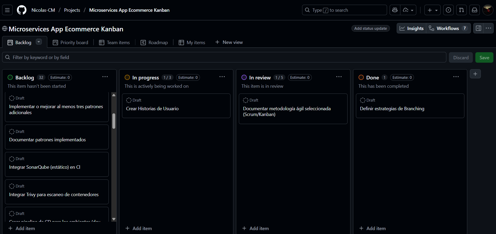
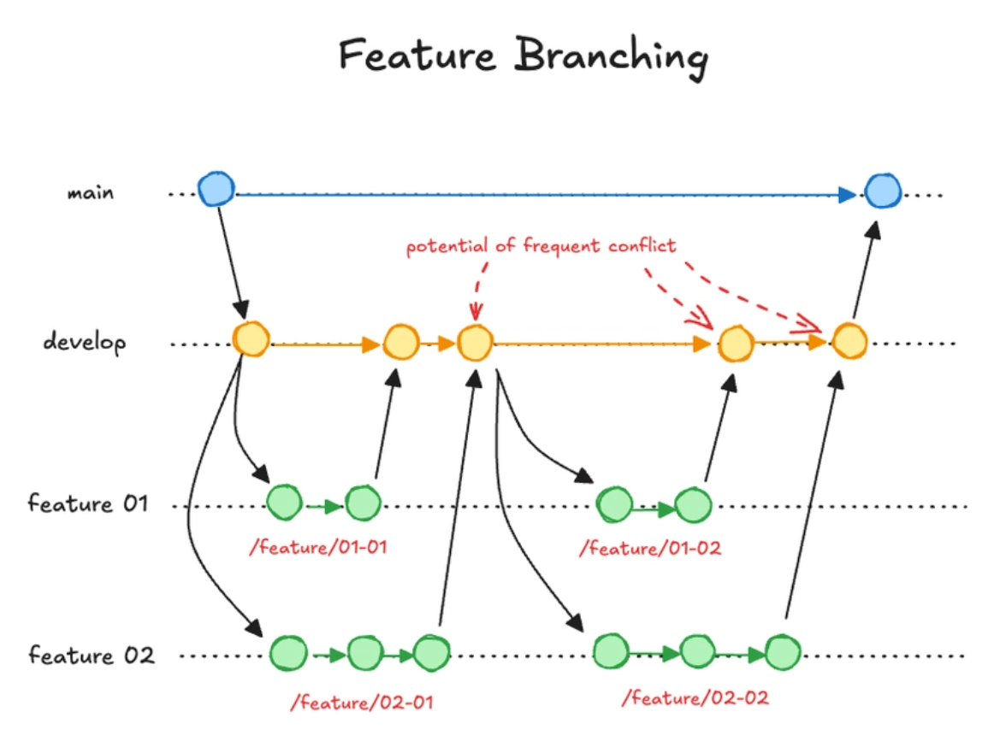
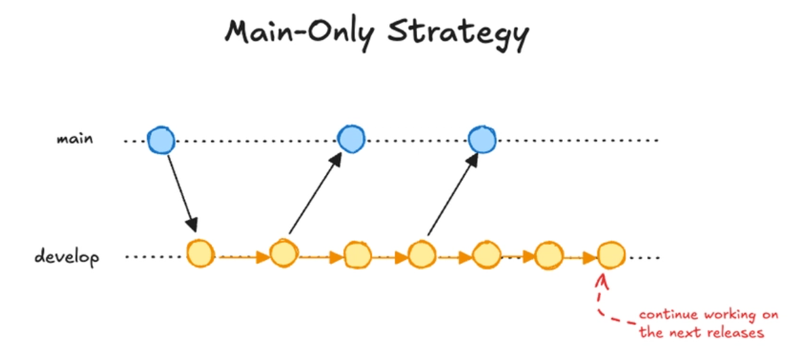

## [Volver al README](../../README.md)

# Estándares del Proyecto

## Metodología: Kanban

La metodología Kanban fue seleccionada para este proyecto porque permite una gestión altamente visual y flexible del flujo de trabajo, lo cual resulta ideal en un entorno de desarrollo de microservicios donde las tareas suelen ser independientes, técnicas y con distinta complejidad. Kanban facilita la entrega continua, la priorización dinámica y la identificación temprana de cuellos de botella, evitando la rigidez de ciclos temporales fijos. Esto permitió mantener un ritmo sostenible, adaptarse rápidamente a cambios en infraestructura, CI/CD y pruebas, y asegurar que el equipo pudiera enfocarse en el progreso constante mediante un tablero transparente y fácil de inspeccionar.

### Sistema de Gestión de Proyectos Ágil: GitHub Projects

Para la gestión y seguimiento del trabajo del proyecto se utilizó GitHub Projects como herramienta central de planificación ágil. Este sistema permitió organizar las tareas mediante un tablero Kanban, gestionar el backlog, priorizar funcionalidades y monitorear el progreso en tiempo real. GitHub Projects facilitó una coordinación clara del flujo de trabajo, integrándose de forma nativa con el repositorio y permitiendo aplicar prácticas ágiles de manera continua durante todo el ciclo de desarrollo.

### Tablero Kanban

- **Backlog**: Tareas pendientes por iniciar
- **In Progress**: Tareas en desarrollo
- **Review**: Tareas en revisión
- **Done**: Tareas completadas

## Estrategia de Branching

### Ramas de Desarrollo

Utilizamos Feature Branching para desarrollo, lo que permite trabajo paralelo y control de calidad.

#### Ramas Principales

| Rama | Propósito | Origen | Merge a |
|------|-----------|--------|----------|
| `main` | Código en producción | - | - |
| `develop` | Desarrollo activo | `main` | `main` |

#### Ramas de Funcionalidad

| Tipo | Formato | Propósito | Origen | Merge a |
|------|---------|-----------|--------|----------|
| Feature | `feature/nombre` | Nuevas funcionalidades | `develop` | `develop` |
| Bugfix | `bugfix/description` | Corrección de errores | `develop` | `develop` |
| Hotfix | `hotfix/description` | Correcciones urgentes | `main` | `main` y `develop` |

### Ramas de Infraestructura

Utilizamos Main-Only Strategy para infraestructura, priorizando la estabilidad y simplicidad.

#### Ramas Principales

| Rama | Propósito | Origen | Merge a |
|------|-----------|--------|----------|
| `main` | Infraestructura en producción | - | - |
| `infra` | Cambios de infraestructura | `main` | `main` |

## Estándar de Commits

| Tipo | Uso |
|------|-----|
| `feat` | Nueva funcionalidad |
| `fix` | Corrección de errores |
| `docs` | Documentación |
| `infra` | Cambios en infraestructura |
| `test` | Pruebas |

### Example

docs: adding images

## [Volver al README](../../README.md)