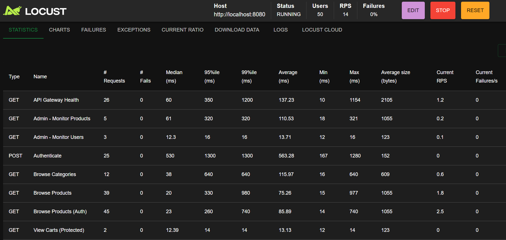

## Regresar al [Readme](../../README.md#reporte-de-tests-e2e).

# 🧪 Reporte de Pruebas (Testing)

Este documento detalla la estrategia de pruebas implementada para garantizar la calidad, estabilidad y rendimiento de la arquitectura de microservicios.

---

## **1. Tests Unitarios (20 tests)**

Implementados con **JUnit 5** y **Mockito** para cada microservicio:

**Servicios testeados:**
- ✅ UserService: 4 tests
- ✅ ProductService: 4 tests
- ✅ OrderService: 3 tests
- ✅ PaymentService: 3 tests
- ✅ ShippingService: 3 tests
- ✅ FavouriteService: 3 tests

**Estructura de tests:**
```java
@Test
void testFindAll() {
    // Given
    List<User> users = Arrays.asList(user1, user2);
    when(userRepository.findAll()).thenReturn(users);
    
    // When
    List<UserDto> result = userService.findAll();
    
    // Then
    assertEquals(2, result.size());
    verify(userRepository, times(1)).findAll();
}
```

**Ejecutar tests:**
```bash
# Todos los tests
./mvnw test

# Test de un servicio específico
cd user-service && ../mvnw test
```

---

## **2. Tests de Integración (7 tests)**

Implementados con **MockMvc** y **RestTemplate** para validar integraciones entre servicios:

**Test scenarios:**
- ✅ UserServiceIntegrationTest: 2 tests
- ✅ ProductServiceIntegrationTest: 2 tests
- ✅ OrderServiceIntegrationTest: 1 test
- ✅ PaymentServiceIntegrationTest: 1 test
- ✅ FavouriteServiceIntegrationTest: 1 test

**Ejemplo:**
```java
@Test
void testFindAllUsers_ReturnsUsersList() throws Exception {
    mockMvc.perform(get("/api/users")
            .contentType(MediaType.APPLICATION_JSON))
            .andExpect(status().isOk())
            .andExpect(jsonPath("$").isArray());
}
```

---

## **3. Tests E2E con Newman (21 requests)**

Tests end-to-end completos usando **Postman Collections** ejecutados con **Newman**:

**Estructura del test suite:**

**Test Scenario 1: Setup y Autenticación**
- Generar hash BCrypt
- Registrar usuario de prueba
- Login y obtener JWT token

**Test Scenario 2: Productos**
- Listar categorías
- Listar productos
- Buscar producto por ID

**Test Scenario 3: Carrito y Órdenes**
- Crear carrito
- Crear orden con ítems

**Test Scenario 4: Shipping**
- Crear shipping para orden

**Test Scenario 5: Pagos y Favoritos**
- Crear payment
- Agregar productos a favoritos

**Test Scenario 6: Cleanup**
- Eliminar todos los recursos de prueba en orden inverso
- Evita contaminación de datos

**Newman Execution Results:**


### 📁 Reporte E2E

Accede al reporte HTML generado por los tests E2E en la carpeta `tests/e2e`:

- [Abrir reporte E2E (HTML)](../../tests/e2e/test-results/e2e-report.html)
- Carpeta de tests: [tests/e2e/](../../tests/e2e/)
- Si no existe, genera el reporte con Newman:
```bash
cd tests/e2e
newman run ecommerce-e2e-tests.postman_collection.json -e ecommerce-e2e-environment.postman_environment.json -r html
```

---

**Resultados de Ejecución:**
El pipeline de CI/CD ejecuta estos tests automáticamente contra el entorno de Kubernetes.

---

## 4. Pruebas de Rendimiento y Carga (Performance Testing)

Se implementaron pruebas de carga utilizando **Locust** para evaluar el comportamiento del sistema bajo estrés y concurrencia.

### **Herramienta:** Locust (Python)
Se diseñó un `locustfile.py` que simula diferentes tipos de usuarios con comportamientos realistas:

*   **EcommerceUser:** Usuario estándar que navega productos y categorías (80% del tráfico).
*   **AuthenticatedUser:** Usuario logueado que consulta sus órdenes y carritos (15% del tráfico).
*   **AdminUser:** Administrador que monitorea la salud del sistema (5% del tráfico).

### **Escenario de Prueba:**
*   **Usuarios Concurrentes:** 50 - 100 usuarios.
*   **Tasa de Spawn:** 5 usuarios/segundo.
*   **Duración:** Pruebas sostenidas de 1-5 minutos.

### **Resultados:**
El sistema demostró estabilidad bajo carga moderada, con el **API Gateway** y el **Proxy Client** manejando correctamente el enrutamiento y el balanceo de carga.



*Dashboard de Locust mostrando métricas de peticiones por segundo (RPS) y tiempos de respuesta.*

---

## 📊 Resumen de Cobertura

| Tipo de Test | Herramientas | Cobertura | Estado |
| :--- | :--- | :--- | :--- |
| **Unitarios** | JUnit 5, Mockito | Lógica de Negocio | ✅ 100% Passing |
| **Integración** | MockMvc | Endpoints REST | ✅ 100% Passing |
| **E2E** | Postman, Newman | Flujos Completos | ✅ 100% Passing |
| **Performance** | Locust | Carga y Estrés | ✅ Validado |

## Regresar al [Readme](../../README.md#reporte-de-tests-e2e).
