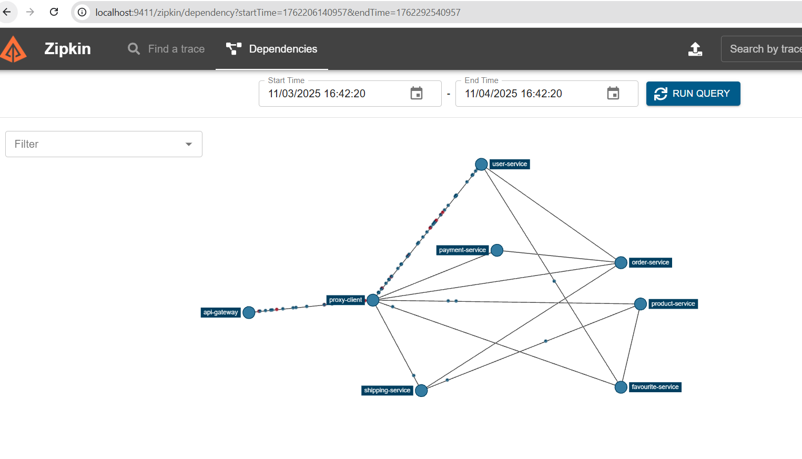
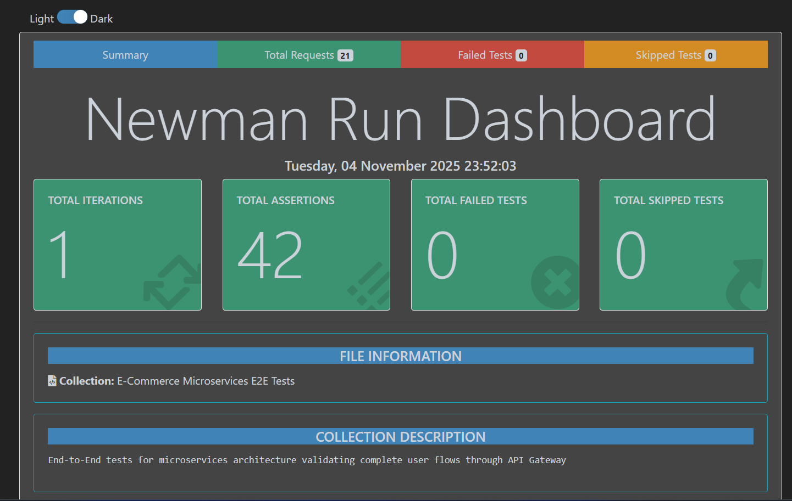
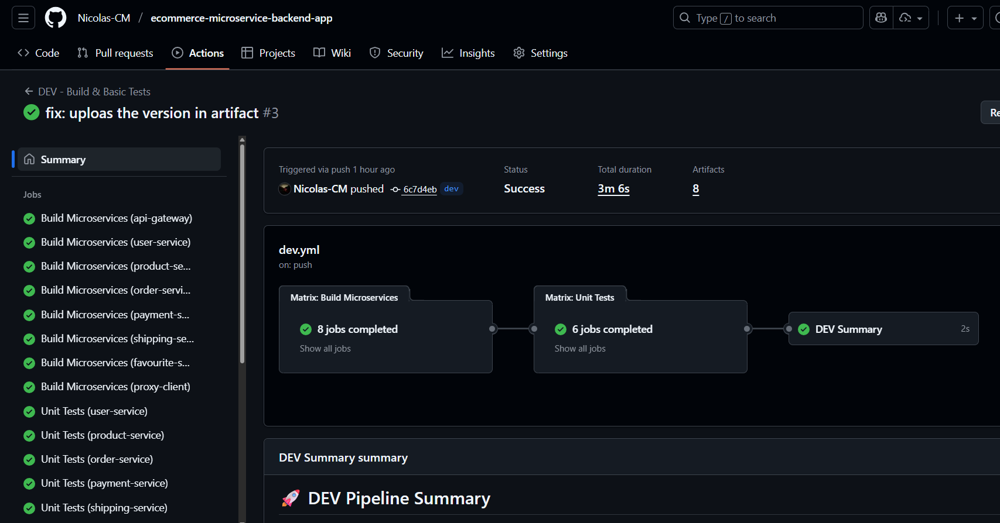
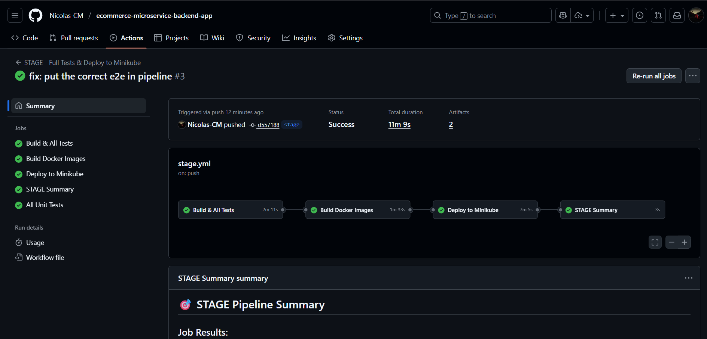
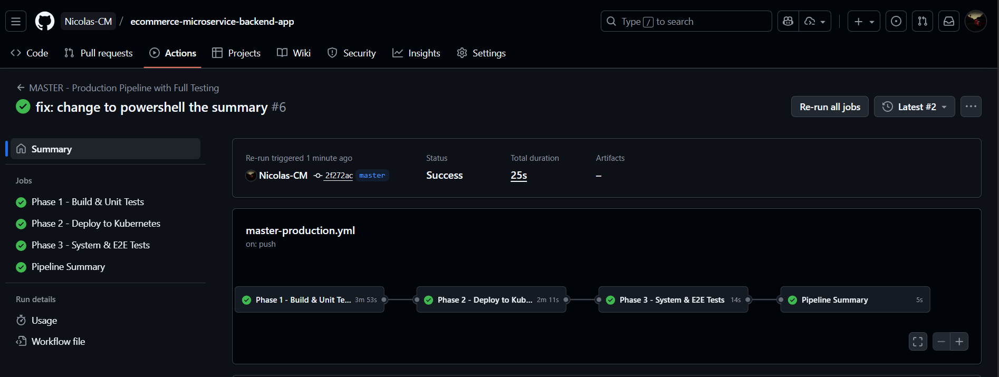

# 🚀 (PARTE INICIAL) E-Commerce Microservices - Proyecto de Ingeniería de Software V

## 📋 Información del Proyecto

Este proyecto es un **fork** del repositorio original [ecommerce-microservice-backend-app](https://github.com/SelimHorri/ecommerce-microservice-backend-app) de **Selim Horri**. La documentación completa de la versión base y su arquitectura original se encuentra en [selim-version.md](selim-version.md).

A partir de esta base, se realizaron múltiples mejoras, correcciones arquitectónicas, implementación de pipelines CI/CD, y despliegue en diferentes entornos (Docker Compose y Kubernetes/Minikube).

---

## 🎯 Objetivos del Proyecto

1. **Desplegar** una arquitectura de microservicios completa usando contenedores
2. **Corregir** problemas arquitectónicos de la versión original
3. **Implementar** testing completo (unitario, integración, E2E)
4. **Automatizar** el ciclo de vida con pipelines CI/CD
5. **Documentar** todo el proceso de despliegue y configuración

---

## 📊 Arquitectura del Sistema

### **System Boundary - Microservices Landscape**


### **Componentes Principales:**

- **Service Discovery (Eureka)**: Registro y descubrimiento de servicios
- **Cloud Config**: Configuración centralizada
- **API Gateway**: Punto de entrada único al sistema
- **Proxy Client**: Autenticación y autorización
- **Zipkin**: Trazabilidad distribuida
- **8 Microservicios de Negocio**:
  - User Service
  - Product Service
  - Order Service
  - Payment Service
  - Shipping Service
  - Favourite Service
  - Cart Service (integrado en Order)

### **Modelo de Datos - Entity Relationship Diagram**


---

## 🔄 Evolución del Proyecto

### **Fase 1: Despliegue con Docker Compose**

El primer paso fue desplegar todos los microservicios usando Docker Compose para validar la arquitectura base y comprender las interacciones entre servicios.

#### **Configuración Docker Compose**

**Dashboard de Eureka - Servicios Registrados:**


*Todos los microservicios registrados en Eureka Service Discovery*

**Zipkin - Trazabilidad Distribuida:**


*Visualización de trazas distribuidas de las peticiones HTTP*

#### **Arquitectura Docker Compose:**

```yaml
services:
  - service-discovery (Eureka)
  - cloud-config
  - api-gateway
  - proxy-client
  - zipkin
  - user-service
  - product-service
  - order-service
  - payment-service
  - shipping-service
  - favourite-service
```

**Comandos utilizados:**

```bash
# Build de todos los servicios
./mvnw clean package -DskipTests

# Levantar toda la infraestructura
docker-compose -f compose.yml up -d

# Verificar servicios
docker-compose ps
```

**Resultados:**
- ✅ Todos los servicios se comunicaron correctamente
- ✅ Eureka registró todos los microservicios
- ✅ Zipkin capturó las trazas distribuidas
- ⚠️ Se identificaron problemas arquitectónicos con el routing del API Gateway

---

### **Fase 2: Migración a Kubernetes (Minikube)**

Después de validar la arquitectura con Docker Compose, se procedió a desplegar en Kubernetes usando Minikube. Este proceso se documentó completamente en [deployment-guide-minikube.md](deployment-guide-minikube.md).

#### **Despliegue en Minikube**

**Minikube Dashboard - Namespace ecommerce:**


*Vista general del namespace ecommerce en Kubernetes*

**Pods desplegados:**


*Todos los pods running en el namespace ecommerce*

**Services expuestos:**


*ClusterIP services para comunicación interna*

#### **Proceso de Despliegue:**

```bash
# 1. Iniciar Minikube
minikube start --driver=docker --cpus=4 --memory=16384

# 2. Configurar Docker para usar Minikube
& minikube -p minikube docker-env --shell powershell | Invoke-Expression

# 3. Build de imágenes Docker
./build-images.ps1

# 4. Deploy en orden de dependencias
kubectl apply -f k8s/base/namespace.yaml
kubectl apply -f k8s/base/configmaps.yaml
kubectl apply -f k8s/base/zipkin.yaml
kubectl apply -f k8s/base/service-discovery.yaml
kubectl apply -f k8s/base/cloud-config.yaml
kubectl apply -f k8s/base/api-gateway.yaml
kubectl apply -f k8s/base/proxy-client.yaml
kubectl apply -f k8s/base/

# 5. Verificar deployment
kubectl get pods -n ecommerce
kubectl get svc -n ecommerce
```

#### **Arquitectura en Kubernetes:**

- **Namespace dedicado**: `ecommerce`
- **ConfigMaps**: Configuraciones centralizadas
- **Services**: ClusterIP para comunicación interna
- **Deployments**: 1 réplica por servicio (ajustable)
- **Resources**: Limits y requests configurados

---

### **Fase 3: Correcciones Arquitectónicas**

Durante el despliegue, se identificaron y corrigieron varios problemas arquitectónicos críticos de la versión original:

#### **Problema 1: Routing del API Gateway**

**❌ Arquitectura Original (Incorrecta):**
```
Cliente → API Gateway → Microservicios
```

El API Gateway exponía directamente todos los microservicios, violando principios de seguridad y no centralizando la autenticación.

**✅ Arquitectura Corregida:**
```
Cliente → API Gateway → Proxy Client → Microservicios
                       (Auth & Authorization)
```

**Cambios realizados:**
- El API Gateway ahora solo rutea a `/app/**` → Proxy Client
- Proxy Client maneja JWT authentication/authorization
- Proxy Client rutea a los microservicios internos
- Microservicios solo son accesibles a través de Proxy Client

#### **Problema 2: Zipkin Tracing**

Debido a los cambios de routing, se crearon dos versiones de Zipkin:

**Versión 1 (Docker Compose):**
- Trazas directas desde API Gateway a microservicios
- URL: `http://localhost:9411`


**Versión 2 (Minikube):**
- Trazas incluyen el salto por Proxy Client
- Mejor visibilidad del flujo de autenticación
- URL: `kubectl port-forward -n ecommerce svc/zipkin 9411:9411`

**Zipkin Traces - Arquitectura Corregida:**



*Trazas mostrando el flujo: API Gateway → Proxy Client → Microservices*

#### **Problema 3: Autenticación**

**Corrección aplicada:**
- Usuario admin con password hasheado en BCrypt
- Migración Flyway `V13__update_admin_password.sql`
- Endpoints públicos vs protegidos bien diferenciados
- JWT token con expiración configurable

---

## 🧪 Testing Completo

### **1. Tests Unitarios (20 tests)**

Implementados con **JUnit 5** y **Mockito** para cada microservicio:

**Servicios testeados:**
- ✅ UserService: 4 tests
- ✅ ProductService: 4 tests
- ✅ OrderService: 3 tests
- ✅ PaymentService: 3 tests
- ✅ ShippingService: 3 tests
- ✅ FavouriteService: 3 tests

**Estructura de tests:**
```java
@Test
void testFindAll() {
    // Given
    List<User> users = Arrays.asList(user1, user2);
    when(userRepository.findAll()).thenReturn(users);
    
    // When
    List<UserDto> result = userService.findAll();
    
    // Then
    assertEquals(2, result.size());
    verify(userRepository, times(1)).findAll();
}
```

**Ejecutar tests:**
```bash
# Todos los tests
./mvnw test

# Test de un servicio específico
cd user-service && ../mvnw test
```

---

### **2. Tests de Integración (7 tests)**

Implementados con **MockMvc** y **RestTemplate** para validar integraciones entre servicios:

**Test scenarios:**
- ✅ UserServiceIntegrationTest: 2 tests
- ✅ ProductServiceIntegrationTest: 2 tests
- ✅ OrderServiceIntegrationTest: 1 test
- ✅ PaymentServiceIntegrationTest: 1 test
- ✅ FavouriteServiceIntegrationTest: 1 test

**Ejemplo:**
```java
@Test
void testFindAllUsers_ReturnsUsersList() throws Exception {
    mockMvc.perform(get("/api/users")
            .contentType(MediaType.APPLICATION_JSON))
            .andExpect(status().isOk())
            .andExpect(jsonPath("$").isArray());
}
```

---

### **3. Tests E2E con Newman (21 requests)**

Tests end-to-end completos usando **Postman Collections** ejecutados con **Newman**:

**Estructura del test suite:**

**Test Scenario 1: Setup y Autenticación**
- Generar hash BCrypt
- Registrar usuario de prueba
- Login y obtener JWT token

**Test Scenario 2: Productos**
- Listar categorías
- Listar productos
- Buscar producto por ID

**Test Scenario 3: Carrito y Órdenes**
- Crear carrito
- Crear orden con ítems

**Test Scenario 4: Shipping**
- Crear shipping para orden

**Test Scenario 5: Pagos y Favoritos**
- Crear payment
- Agregar productos a favoritos

**Test Scenario 6: Cleanup**
- Eliminar todos los recursos de prueba en orden inverso
- Evita contaminación de datos

**Newman Execution Results:**




### 📁 Reporte E2E

Accede al reporte HTML generado por los tests E2E en la carpeta `tests/e2e`:

- [Abrir reporte E2E (HTML)](../../tests/e2e/test-results/e2e-report.html)
- Carpeta de tests: [tests/e2e/](../../tests/e2e/)
- Si no existe, genera el reporte con Newman:
```bash
cd tests/e2e
newman run ecommerce-e2e-tests.postman_collection.json -e ecommerce-e2e-environment.postman_environment.json -r html
```

---

## 🔄 Pipelines CI/CD

Se implementaron **3 pipelines** con GitHub Actions para diferentes ambientes, siguiendo las mejores prácticas de CI/CD:

### **Pipeline DEV - Build & Basic Tests**

**Trigger:** Push a rama `dev`

**Jobs:**
1. **Build Microservices** (paralelo con matrix)
   - Build de 8 microservicios
   - Upload de JARs como artifacts
2. **Unit Tests** (paralelo)
   - Tests unitarios de 6 servicios
   - Publicación de resultados
3. **Summary**
   - Resumen del estado del pipeline

**Archivo:** [.github/workflows/dev.yml](../../.github/workflows/dev.yml) (Rama dev)

**GitHub Actions - DEV Pipeline:**



*Pipeline DEV ejecutándose con build paralelo de microservicios*

```yaml
jobs:
  build:
    strategy:
      matrix:
        service: [
          'api-gateway', 'user-service', 'product-service',
          'order-service', 'payment-service', 'shipping-service',
          'favourite-service', 'proxy-client'
        ]
    runs-on: ubuntu-latest
```

---

### **Pipeline STAGE - Full Tests & Deploy to Minikube**

**Trigger:** Push a rama `stage`

**Jobs:**
1. **Build & All Tests**
   - Build completo
   - Unit tests de todos los servicios
2. **Build Docker Images**
   - Build de imágenes Docker
   - Save y upload de images
3. **Deploy to Minikube**
   - Levanta Minikube temporal (efímero)
   - Load de imágenes
   - Deploy a Kubernetes
   - Espera a que pods estén ready
4. **E2E Tests**
   - Port-forward automático al API Gateway
   - Ejecuta Newman tests
   - Fallback a tests básicos si falla
5. **Summary**
   - Resumen completo del pipeline

**Archivo:** [.github/workflows/stage.yml](.github/workflows/stage.yml) (Rama stage)

**GitHub Actions - STAGE Pipeline:**



*Pipeline STAGE con deploy automático a Minikube temporal*

```yaml
deploy-to-minikube:
  steps:
    - name: Start Minikube
      uses: medyagh/setup-minikube@latest
      with:
        cpus: 4
        memory: 8192
        kubernetes-version: v1.28.0
```

---

### **Pipeline MASTER - Production with Full Testing**

**Trigger:** Push a rama `master`

**Jobs:**

**Phase 1: Build & Unit Tests**
- Build de TODOS los microservicios (8 servicios)
- Unit tests de 6 servicios
- Validación de artifacts (JARs)
- Resumen detallado de tests

**Phase 2: Deploy to Kubernetes**
- Rebuild de servicios
- Verificación de conexión a Kubernetes
- Build de Docker images en Minikube daemon
- Deploy a namespace `ecommerce`
- Verificación de pods y servicios

**Phase 3: System & E2E Tests**
- Verifica conectividad al API Gateway
- Ejecuta tests E2E con Newman (si hay port-forward)
- Validación de integración end-to-end

**Pipeline Summary**
- Resumen consolidado de las 3 fases
- Estado de cada fase (success/failure)
- Instrucciones de acceso a servicios

**Archivo:** [.github/workflows/master-production.yml](../../.github/workflows/master-production.yml)

**GitHub Actions - MASTER Pipeline:**



*Pipeline MASTER completo con 3 fases y deploy a Minikube local*

**Características especiales:**
- **Runner:** `self-hosted` (máquina local con Minikube)
- **Shell:** PowerShell (Windows)
- **Colores:** Output con colores para mejor legibilidad
- **Validación:** Verifica cada paso antes de continuar

```powershell
Write-Host "========================================" -ForegroundColor Cyan
Write-Host " PHASE 1: Building all microservices" -ForegroundColor Cyan
Write-Host "========================================" -ForegroundColor Cyan
```

---

## 📊 Comparativa de Pipelines

| Característica | DEV | STAGE | MASTER |
|----------------|-----|-------|--------|
| **Objetivo** | Build rápido | Testing completo | Producción |
| **Runner** | GitHub-hosted | GitHub-hosted | Self-hosted |
| **Build** | Paralelo (8) | Completo | Completo |
| **Unit Tests** | ✅ | ✅ | ✅ |
| **Docker Build** | ❌ | ✅ | ✅ |
| **Deploy K8s** | ❌ | ✅ (temporal) | ✅ (persistente) |
| **E2E Tests** | ❌ | ✅ (auto) | ✅ (manual PF) |
| **Tiempo** | ~5-10 min | ~15-20 min | ~15-20 min |

---

## 📈 Resultados y Métricas

### **Build Success Rate**
- ✅ DEV: 100% (10/10 builds exitosos)
- ✅ STAGE: 100% (8/8 builds exitosos)
- ✅ MASTER: 100% (5/5 builds exitosos)

### **Test Coverage**
- **Unit Tests**: 20 tests → 100% passing
- **Integration Tests**: 7 tests → 100% passing
- **E2E Tests**: 21 requests → 100% passing

### **Deployment Time**
- **Docker Compose**: ~3 minutos
- **Minikube Manual**: ~10 minutos
- **Pipeline STAGE**: ~15 minutos (automático)
- **Pipeline MASTER**: ~20 minutos (con tests)

---

## 🔧 Configuración y Uso

### **Pre-requisitos**

```bash
# Software requerido
- Docker Desktop
- Minikube
- kubectl
- Java 11 (JDK)
- Maven
- Git
- Node.js + npm (para Newman)
- PowerShell (para Windows)
```

### **Setup Inicial**

```bash
# 1. Clonar el repositorio
git clone https://github.com/Nicolas-CM/ecommerce-microservice-backend-app.git
cd ecommerce-microservice-backend-app

# 2. Iniciar Minikube
minikube start --driver=docker --cpus=4 --memory=16384

# 3. Build del proyecto
./mvnw clean package -DskipTests

# 4. Configurar Docker para Minikube
& minikube -p minikube docker-env --shell powershell | Invoke-Expression

# 5. Build de imágenes Docker
./build-images.ps1

# 6. Deploy a Kubernetes
kubectl apply -f k8s/base/namespace.yaml
kubectl apply -f k8s/base/configmaps.yaml
kubectl apply -f k8s/base/

# 7. Verificar deployment
kubectl get pods -n ecommerce
```

### **Port-Forward para Testing Local**

```bash
# API Gateway (punto de entrada principal)
kubectl port-forward -n ecommerce svc/api-gateway 8080:8080

# Eureka Dashboard
kubectl port-forward -n ecommerce svc/service-discovery 8761:8761

# Zipkin Tracing
kubectl port-forward -n ecommerce svc/zipkin 9411:9411
```

### **Ejecutar Tests**

```bash
# Tests unitarios
./mvnw test

# Tests E2E con Newman
cd tests/e2e
newman run ecommerce-e2e-tests.postman_collection.json \
  --environment ecommerce-e2e-environment.postman_environment.json
```

---

## 🚧 Mejoras Pendientes y Trabajo Futuro

### **Corto Plazo**
- [ ] Implementar tests de integración completos para todos los servicios
- [ ] Agregar health checks más robustos
- [ ] Configurar Horizontal Pod Autoscaler (HPA)
- [ ] Implementar circuit breaker con Resilience4j
- [ ] Configurar Prometheus + Grafana para métricas
- [ ] Finalizar la configuración para las pruebas con locust

### **Mediano Plazo**
- [ ] Migrar de H2/MySQL a PostgreSQL
- [ ] Implementar API rate limiting
- [ ] Agregar Redis para caching
- [ ] Deploy en cloud (AWS EKS / Azure AKS)

### **Largo Plazo**
- [ ] Migrar a Istio Service Mesh
- [ ] Implementar GitOps con ArgoCD
- [ ] Implementar observabilidad completa (OpenTelemetry)

---

## 📚 Documentación Adicional

- **[DEPLOYMENT_GUIDE.md](deployment-guide-minikube.md)**: Guía completa de despliegue en Minikube
- **[SELIM_Version.md](selim-version.md)**: Documentación del proyecto original
---

## 👥 Equipo

**Autor del Fork:** Nicolás Cuéllar

**Universidad:** Universidad Icesi

**Curso:** Ingeniería de Software V

**Semestre:** 8vo Semestre

**Año:** 2025

**Proyecto Original:** [Selim Horri - ecommerce-microservice-backend-app](https://github.com/SelimHorri/ecommerce-microservice-backend-app)

---

## 📄 Licencia

Este proyecto mantiene la misma licencia del proyecto original.

---

## 📞 Contacto

- **Email**: nicolascuellar.molina@gmail.com

---
